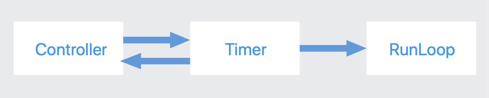
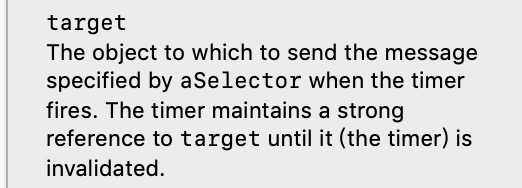
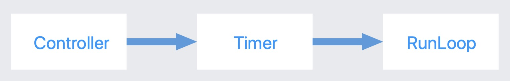

## NSTimer

### 注意点

* 必须将定时器加入runloop,子线程需要手动开启runloop

* NSTimer初始化的时候，分两种情况，一种是自动将timer加入runloop,还有一种需要手动加入到runloop中

### 循环引用

#### 情况一

NSTimer并不是一定会产生循环引用，如果repeat为NO，不会产生。如果repeat为YES,就会产生循环引用。

#### 情况二

Controller强引用Timer,会发生循环引用

  	[NSTimer scheduledTimerWithTimeInterval:1.0 target:self selector:@selector(timerRun) userInfo:nil repeats:YES];

看该方法定义，target会被强引用
    
#### 情况三

Controller不强引用Timer
    

这种情况timer对控制器进行了强引用，如果在Controller销毁前没有销毁Timer,会产生循环引用

### 失败的解决办法

     __weak typeof(self) weakSelf = self;
    NSTimer *timer = [NSTimer scheduledTimerWithTimeInterval:1.0 target:weakSelf selector:@selector(timerRun) userInfo:nil repeats:YES];
    
将self用weak修饰，这样也行不通。大家可以想象timer内部有一个strong的target属性，只要给它赋值，引用计数就会加1，不会去管这个对象是以什么形式传递给它的。

### 解决办法

采用中间件方案进行解决

* 中间件弱引用Controller
* 将中间件做为target传给timer
* 在Controller的dealloc方法中一定要记得销毁timer,释放中间件

