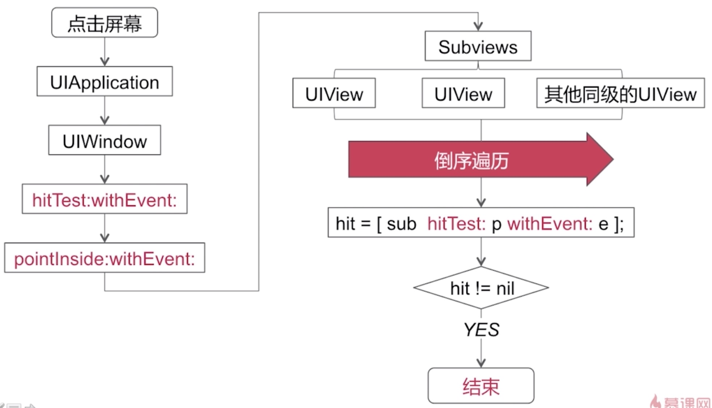

## 事件传递和响应

### UIView 和 CALayer

* UIView为其提供内容，以及负责处理触摸等事件，参与响应链
* CALayer负责显示内容contents

### 事件传递

     - (UIView *)hitTest:(CGPoint)point withEvent:(UIEvent *)event;

     - (BOOL)pointInside:(CGPoint)point withEvent:(UIEvent *)event;

面试题：
>让一个Button，以中心点为圆心，宽的一半为半径。在这个圆形范围内可以响应点击事件，四个角不响应。

>重新上面两个方法，在pointInside方法里判断当前点击点的坐标是否在圆形方位内，就返回YES响应，如果不在，就返回NO

### 视图事件响应

    - (void)touchesBegan:(NSSet<UITouch *> *)touches withEvent:(UIEvent *)event;

    - (void)touchesMoved:(NSSet<UITouch *> *)touches withEvent:(UIEvent *)event;

    - (void)touchesEnded:(NSSet<UITouch *> *)touches withEvent:(UIEvent *)event;

