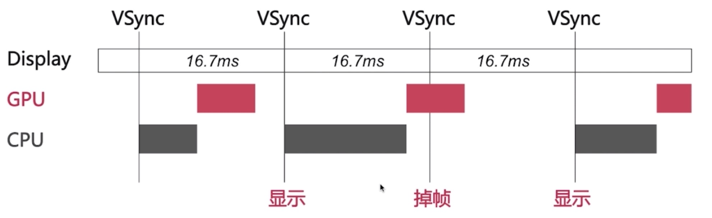

# UI卡顿、掉帧的原因

在规定的16.7毫秒之内，在下一帧VSync信号到来之前，并没有CPU和GPU共同完成画面的合成，于是就导致卡顿和掉帧

## 滑动优化方案

* CPU
  * 对象创建、调整、销毁放在子线程
  * 预排版（布局计算、文本计算）放在子线程
  * 预渲染（文本等异步绘制，图片编解码等
* GPU
  * 避免离屏渲染
  * 视图层级非常复杂，有多个视图层层叠加，就要做每一个视图的合成
