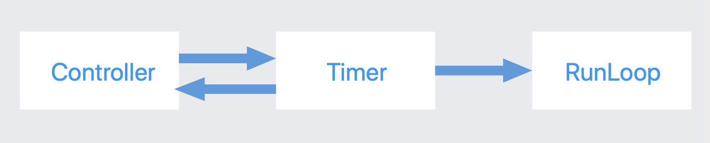
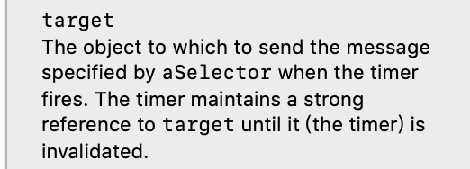
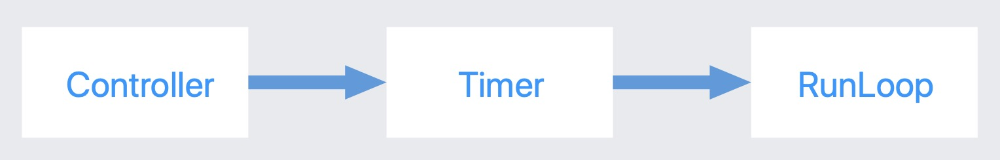

# NSTimer

## 注意点

* 必须将定时器加入runloop,子线程需要手动开启runloop

* NSTimer初始化的时候，分两种情况，一种是自动将timer加入runloop,还有一种需要手动加入到runloop中

## 循环引用

### 情况一

NSTimer并不是一定会产生循环引用，如果`repeat为NO，不会产生`。如果repeat为YES,就会产生循环引用。

### 情况二

Controller强引用Timer,会发生循环引用

    [NSTimer scheduledTimerWithTimeInterval:1.0 target:self selector:@selector(timerRun) userInfo:nil repeats:YES];

看该方法定义，target会被强引用

#### 情况三

Controller不强引用Timer

这种情况timer对控制器进行了强引用，如果在Controller销毁前没有销毁Timer,会产生循环引用

### 失败的解决办法

     __weak typeof(self) weakSelf = self;
    NSTimer *timer = [NSTimer scheduledTimerWithTimeInterval:1.0 target:weakSelf selector:@selector(timerRun) userInfo:nil repeats:YES];

__weak是属于block的一个技术方法，因为block内部会将修饰符一起捕获。因此将self用weak修饰，在NSTimer这行不通。大家可以想象timer内部有一个strong的target属性，只要给它赋值，引用计数就会加1，不会去管这个对象是以什么形式传递给它的。

### 解决办法

1.采用中间件方案进行解决

* 中间件弱引用Controller
* 将中间件做为target传给timer
* 在Controller的dealloc方法中一定要记得销毁timer,释放中间件

NSProxy做中间件，比NSObject做中间件效率更高，因为NSProxy会直接走转发机制，NSObject还会去走消息查找那一套流程，找不到才会去走转发。

2.iOS10以上版本

    __weak typeof(self) weakSelf = self;
    [NSTimer scheduledTimerWithTimeInterval:1.0 repeats:YES block:^(NSTimer * _Nonnull timer) {
        [weakSelf test];
    }];

iOS10以上版本可以采用该API，因为__weak在block中有效。
