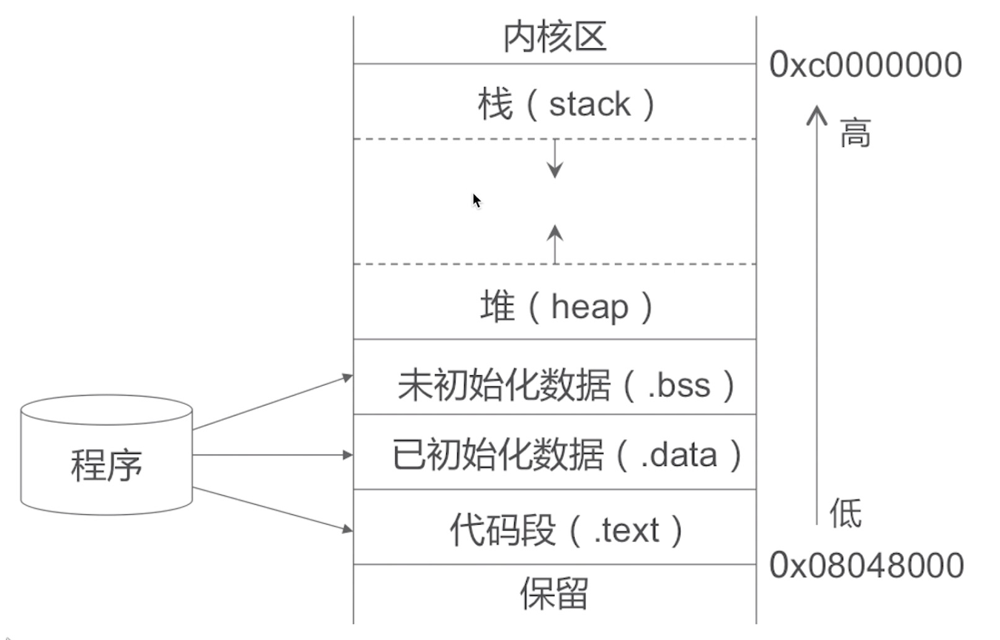
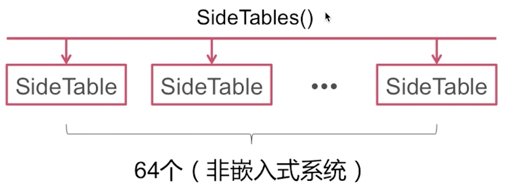
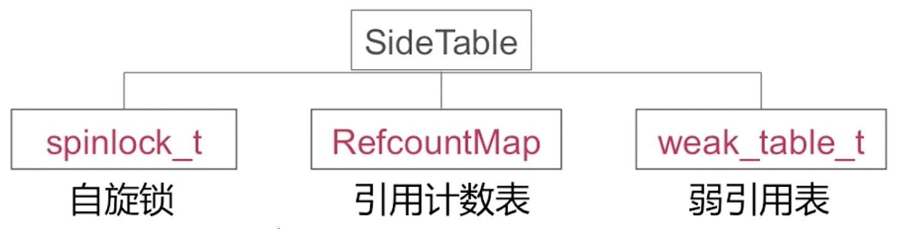
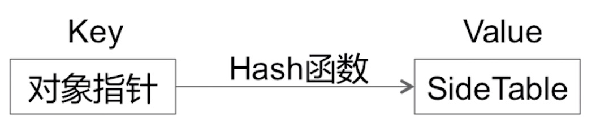

## 内存管理

* stack:方法调用
* heap:通过alloc等分配的对象
* bss:未初始化的全局变量等
* data:已初始化的全局变量等
* text:程序代码

## 内存管理方案

不同场景下，使用方案不同
* TaggedPointer （小对象）
* NONPOINTER_ISA （64位应用程序）
* 散列表

### 散列表

散列表结构

Side Tables()结构

Side Table结构

面试题：

为什么不是一个Side Table?

>假如说只有一张表，相当于我们在内存当中分配的所有对象的引用计数或者说弱引用存储都放到一张大表当中。这时候如果说我们要修改某一个对象的引用计数进行修改，加一或者说减一的操作。所有的对象可能是在不同的线程当中创建的，包括调用它们的release，retain等，也可能是在不同的方法当中操作。那么这个时候，我们对这张表操作的时候，就需要加锁，才能保证数据的访问安全。那么在这个过程当中就会存在一个效率的问题。

### 分离锁

为了解决上面的问题，引入了一个分离锁的概念。我们可以把内存对象对应的引用技术表可以分开成多个部分，比如说我们把它分开成8个，那么就可以对8个表分别加锁。如果某一个对象a在一张表里，另一个对象b在另一张表里。那么当a和b同时进行引用计数操作的时候，可以并发操作。如果是一张表，那就需要顺序操作。分离锁的方案，可以提高访问效率。

### 怎样实现快速分流？

Side Tables的本质是一张Hash表。这张Hash表当中可能有64张具体的Side Table然后存储不同对象的引用计数表和弱引用表。

