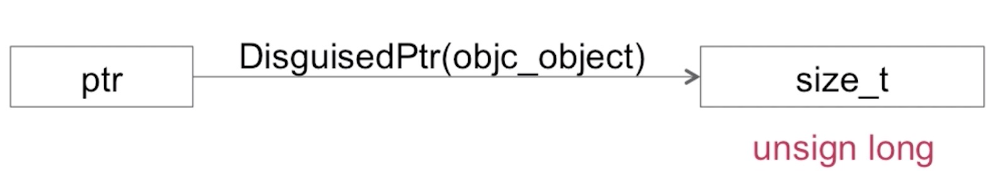
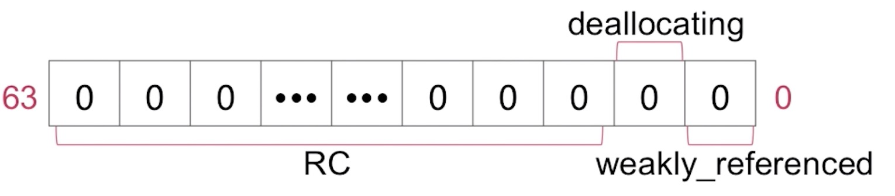
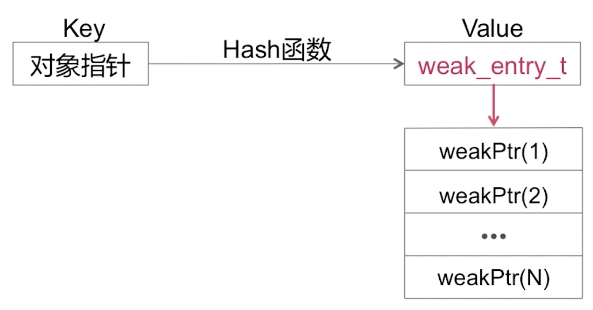

## 散列表数据结构

* Spinlock_t（自旋锁）
* RefcountMap（引用计数表）
* weak_table_t（弱引用表）

### Spinlock_t

* Spinlock_t是“忙等”的锁
* 适用于轻量访问
  
### RefcountMap

引用计数表也是一个Hash表，我们可以通过一个指针找到对应对象的引用计数，这个查找也是一个Hash查找。

这个Hash算法是对传入对象的指针做一个伪装的操作，然后去获取对应的引用计数

size_t（引用计数）

第一个二进制位表示的是对象是否有弱引用，0就是没有，1就是有
第二个二进制位表示当前对象是否正在dealloc
剩下的位数就是当前对象的引用计数值，实际计算中，需要向右偏移两位，去掉后面的两位
 
### weak_table_t

弱引用表也是一张Hash表

weak_entry_t是一个结构体数组，数组中存储弱引用指针