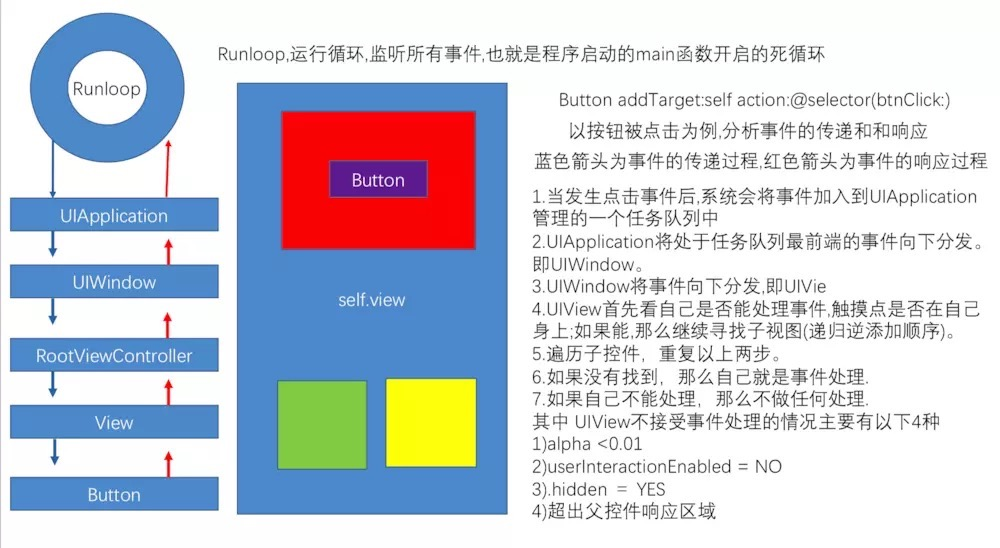

## 事件传递，响应者链条

### 事件的产生

发生触摸事件后，系统会将该事件加入到一个由UIApplication管理的事件队列中,为什么是队列而不是栈？因为队列的特点是FIFO，即先进先出，先产生的事件先处理才符合常理，所以把事件添加到队列。

UIApplication会从事件队列中取出最前面的事件，并将事件分发下去以便处理，通常，先发送事件给应用程序的主窗口（keyWindow）。

主窗口会在视图层次结构中找到一个最合适的视图来处理触摸事件，这也是整个事件处理过程的第一步。
找到合适的视图控件后，就会调用视图控件的touches方法来作具体的事件处理。

### 事件的传递

* 触摸事件的传递是从父控件传递到子控件

* 也就是UIApplication->window->寻找处理事件最合适的view

**注 意**: 如果父控件不能接受触摸事件，那么子控件就不可能接收到触摸事件

### 事件的响应

首先看initial view能否处理这个事件，如果不能则会将事件传递给其上级视图（inital view的superView）；如果上级视图仍然无法处理则会继续往上传递；一直传递到视图控制器view controller，首先判断视图控制器的根视图view是否能处理此事件；如果不能则接着判断该视图控制器能否处理此事件，如果还是不能则继续向上传 递；（对于第二个图视图控制器本身还在另一个视图控制器中，则继续交给父视图控制器的根视图，如果根视图不能处理则交给父视图控制器处理）；一直到 window，如果window还是不能处理此事件则继续交给application处理，如果最后application还是不能处理此事件则将其丢弃

### 事件的传递和响应的区别：

事件的传递是从上到下（父控件到子控件），事件的响应是从下到上（顺着响应者链条向上传递：子控件到父控件

### 资料

[史上最详细的iOS之事件的传递和响应机制-原理篇](https://www.jianshu.com/p/2e074db792ba)

