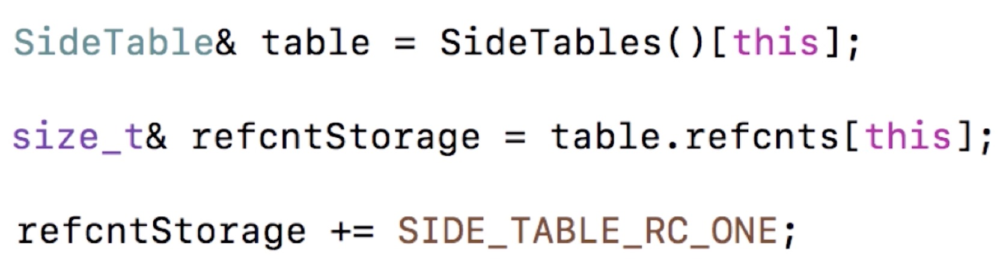
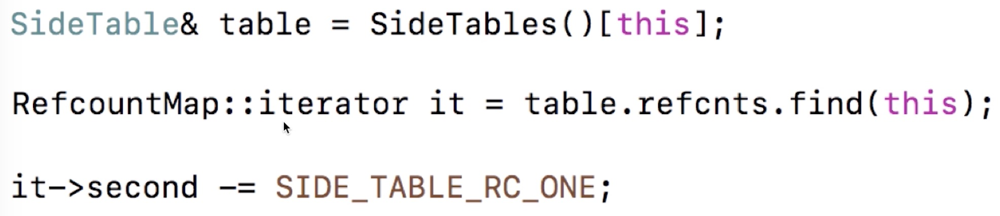
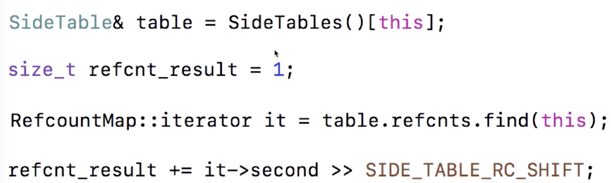
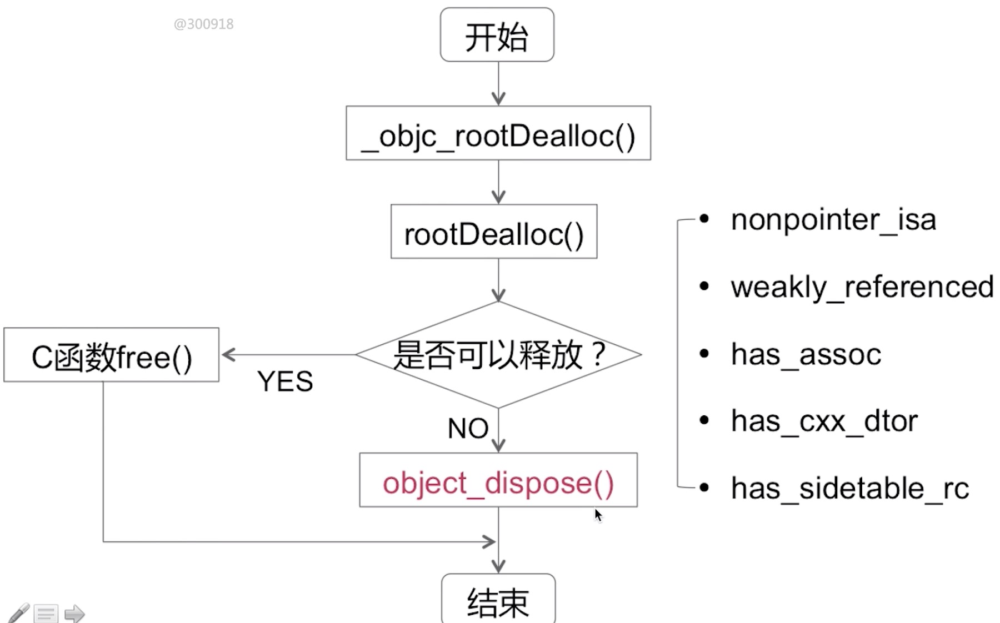
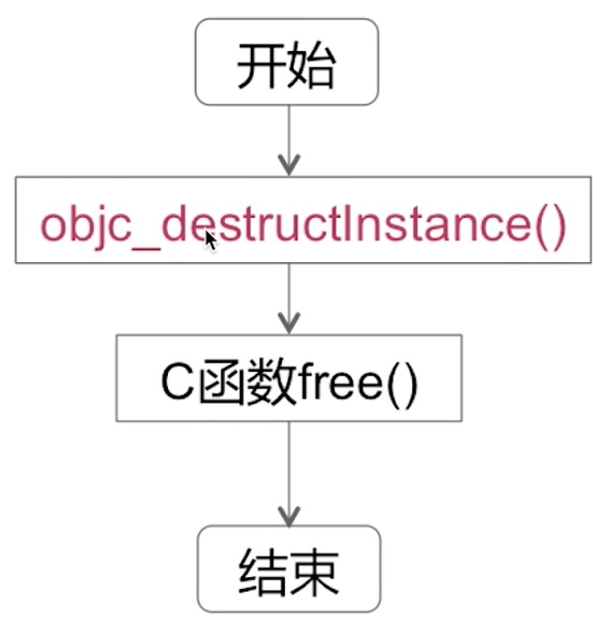
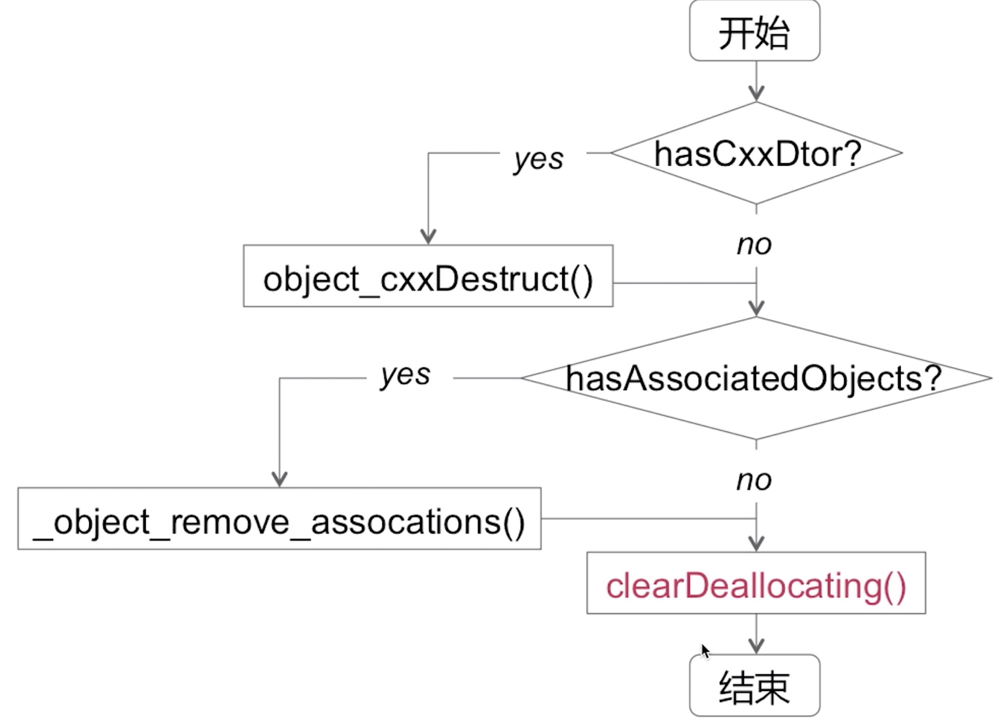
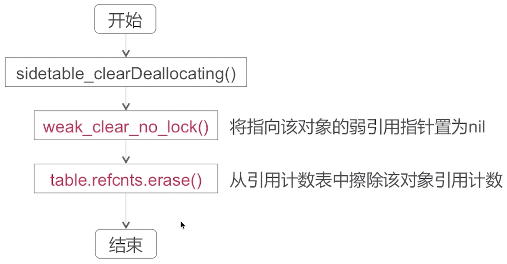

### ARC

自动引用计数

* ARC是LLVM和Runtime协作来进行内存管理
* ARC中禁止手动调用retain/release/retainCount/dealloc
* ARC中新增weak、strong属性关键字

### 引用计数管理

alloc实现
* 经过一系列调用，最终调用了C函数calloc
* 此时并没有设置引用计数为1 （因为引用计数表中还没建立和当前对象的映射）

retain实现

根据当前对象的指针获取到它所属的table， 然后然后通过当前对象的指针在table的引用计数表中获取到当前对象的引用计数。经过两次Hash查找，当道当前对象的引用计数，进行加1操作。

release实现

retainCount实现

dealloc实现

对象是否可以直接释放的条件：
* nonpointer_isa:当前对象是否使用了非指针形的isa
* weakly_referenced:是否有weak指针指向它
* has_assoc:是否有关联对象
* has_cxx_dtor:判断内部实现是否有涉及到一些C++相关的内容，以及当前对象是否使用ARC来管理内存
* has_sidetable_rc:当前对象的引用计数是否是通过side table当中的引用计数表来维护的

object_dispose()实现

objc_destructInstance()实现

clearDeallocating()实现

