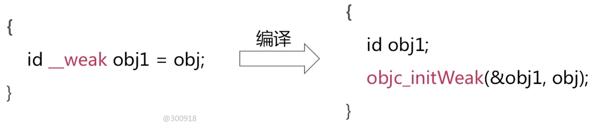

## 弱引用管理

#### 添加weak变量

步骤：

* 1.根据obj对象的指针从SideTables找到当前对象对应的SideTable
* 2.通过obj对象的指针从弱引用表当中查找它所对应的弱引用的数组，通过obj对象的指针地址进行了一个哈希算法的计算，获取到这个对象在弱引用表当中对应的索引位置
* 3.把弱引用指针添加到这个数组之中，如果没有获取到弱引用数组，那么需要重新创建一个弱引用数组，然后把第0个位置添加上最新的weak指针

#### 清除weak变量，同时设置指向为nil

底层方法:
第一个参数：弱引用表
第二个参数：引用的ID，也就是weak指针指向的对象

    weak_clear_no_lock(weak_table_t *weak_table, id referent_id)

步骤：

* 1.根据referent_id从弱引用表当中查找弱引用数组。通过被废弃对象的指针，经过一个哈希算法的计算求出弱引用数组索引位置，通过索引返回当前对象对应的弱引用数组。
* 2.通过for循环将所有的当前对象所有的弱引用指针置为nil

