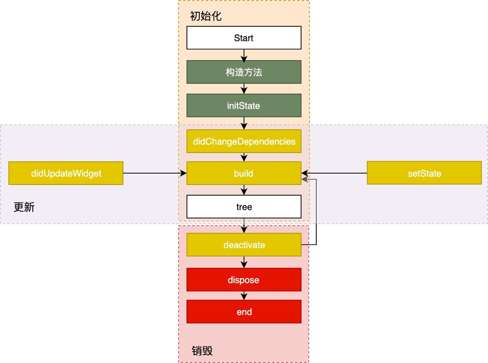
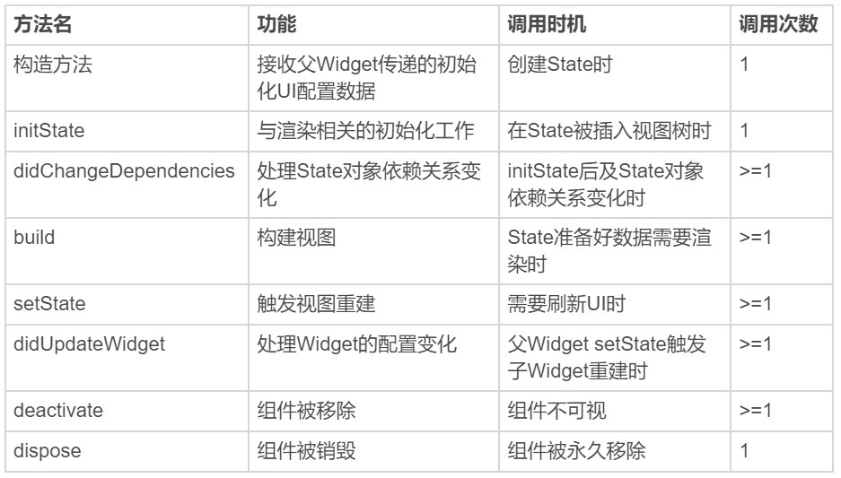

## 生命周期

本内容都来自极客时间陈浩Flutter课程第十一课

### State 生命周期

### App生命周期

来监听 App 的生命周期并做相应的处理。而在 Flutter 中，我们可以利用WidgetsBindingObserver，来实现同样的需求。

	abstract class WidgetsBindingObserver {
	  // 页面 pop
	  Future<bool> didPopRoute() => Future<bool>.value(false);
	  // 页面 push
	  Future<bool> didPushRoute(String route) => Future<bool>.value(false);
	  // 系统窗口相关改变回调，如旋转
	  void didChangeMetrics() { }
	  // 文本缩放系数变化
	  void didChangeTextScaleFactor() { }
	  // 系统亮度变化
	  void didChangePlatformBrightness() { }
	  // 本地化语言变化
	  void didChangeLocales(List<Locale> locale) { }
	  //App 生命周期变化
	  void didChangeAppLifecycleState(AppLifecycleState state) { }
	  // 内存警告回调
	  void didHaveMemoryPressure() { }
	  //Accessibility 相关特性回调
	  void didChangeAccessibilityFeatures() {}
	}
	
AppLifecycleState

* resumed：可见的，并能响应用户的输入。
* inactive：处在不活动状态，无法处理用户响应。
* paused：不可见并不能响应用户的输入，但是在后台继续活动中。

