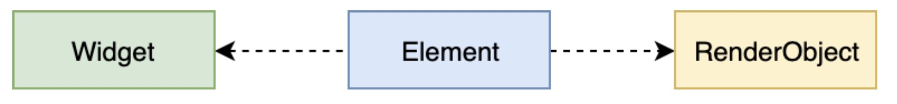

## Widget渲染

在进行 App 开发时，我们往往会关注的一个问题是：如何结构化地组织视图数据，提供给渲染引擎，最终完成界面显示。

通常情况下，不同的 UI 框架中会以不同的方式去处理这一问题，但无一例外地都会用到视图树（View Tree）的概念。而 Flutter 将视图树的概念进行了扩展，把视图数据的组织和渲染抽象为三部分，即 Widget，Element 和RenderObject。

### Widget

Widget 是 Flutter 世界里对视图的一种结构化描，你可以把它看作是前端中的“控件”或“组件”。Widget 是控件实现的基本逻辑单位，里面存储的是有关视图渲染的配置信息，包括布局、渲染属性、事件响应信息等。

在页面渲染上，Flutter 将“Simple is besbest”这一理念做到了极致。为什么这么说呢？Flutter 将 Widget 设计成不可变的，所以当视图渲染的配置信息发生变化时，Flutter 会选择重建 Widget 树的方式进行数据更新，以数据驱动 UI 构建的方式简单高效。

但，这样做的缺点是，因为涉及到大量对象的销毁和重建，所以会对垃圾回收造成压力。不过，Widget 本身并不涉及实际渲染位图，所以它只是一份轻量级的数据结构，重建的成本很低。

另外，由于 Widget 的不可变性，可以以较低成本进行渲染渲染节点复用，因此在一个真实的渲染树中可能存在不同的 Widget 对应同一个渲染节点的情况，这无疑又降低了重建 UI 的成本。

### Element

Element 是 Widget 的一个实例化对象，它承载了视图构建的上下文数据，是连接结构化的配置信息到完成最终渲染的桥梁。

Flutter 渲染过程，可以分为这么三步：

* 首先，通过 Widget 树生成对应的 Element 树；
* 然后，创建相应的 RenderObject 并关联到 Element.renderObject 属性上；
* 最后，构建成 RenderObject 树，以完成最终的渲染。

可以看到，Element 同时持有 Widget 和 RenderObject。而无论是 Widget 还是Element，其实都不负责最后的渲染，只负责发号施令，真正去干活儿的只有 RenderObject。那你可能会问，既然都是发号施令，那为什么需要增加中间的这层 Element 树呢？直接由 Widget 命令 RenderObject 去干活儿不好吗？

答案是，可以，但这样做会极大地增加渲染带来的性能损耗。

因为 Widget 具有不可变性，但 Element 却是可变的。实际上，Element 树这一层将Widget 树的变化（类似 React 虚拟 DOM diff）做了抽象，可以只将真正需要修改的部分同步到真实的 RenderObject 树中，最大程度降低对真实渲染视图的修改，提高渲染效率，而不是销毁整个渲染视图树重建。

这，就是 Element 树存在的意义。

### RenderObject

RenderObject 是主要负责实现视图渲染的对象。

而渲染对象树在 Flutter 的展示过程分为四个阶段，即布局、绘制、合成和渲染。 其中，布局和绘制在 RenderObject 中完成，Flutter采用深度优先机制遍历渲染对象树，确定树中各个对象的位置和尺寸，并把它们绘制到不同的图层上。绘制完毕后，合成和渲染的工作则交给 Skia 搞定。

Flutter 通过引入 Widget、Element 与 RenderObject 这三个概念，把原本从视图数据到视图渲染的复杂构建过程拆分得更简单、直接，在易于集中治理的同时，保证了较高的渲染效率。

### 总结

Widget 是 Flutter 世界里对视图的一种结构化描述，里面存储的是有关视图渲染的配置信息；Element 则是 Widget 的一个实例化对象，将 Widget 树的变化做了抽象，能够做到只将真正需要修改的部分同步到真实的 Render Object 树中，最大程度地优化了从结构化的配置信息到完成最终渲染的过程；而 RenderObject，则负责实现视图的最终呈现，通过布局、绘制完成界面的展示。

如果用 Vue 来比喻的话，Widget 就是 Vue 的 template；Element 就是 virtual DOM；RenderObject 就是DOM。

