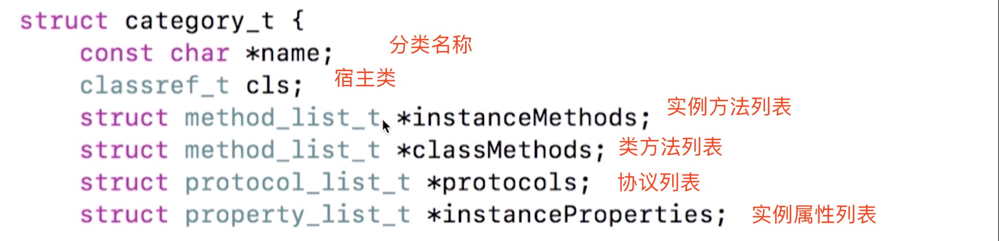

# 分类（category）

## 你用分类做了哪些事

* 声明私有方法
* 分解体积庞大的类文件
* 把Framework的私有方法公开

## 特点

* 运行时决议
* 可以为系统类添加分类

## 分类中可以添加哪些内容

* 实例方法
* 类方法
* 协议
* 属性（分类里面添加属性，只会生成get和set方法的声明）

## 总结

* 分类添加的方法可以“覆盖”原类方法（消息传递的过程中优先查找数组靠前的元素，如果找到了一个同名的方法就立即调用）
* 同名分类方法谁能生效取决于编译顺序
* 名字相同的分类会引起编译错误
