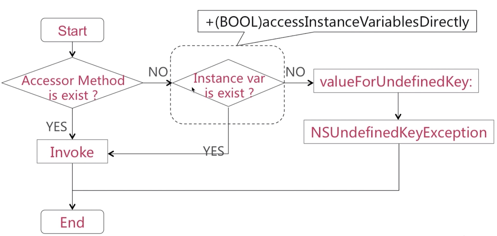
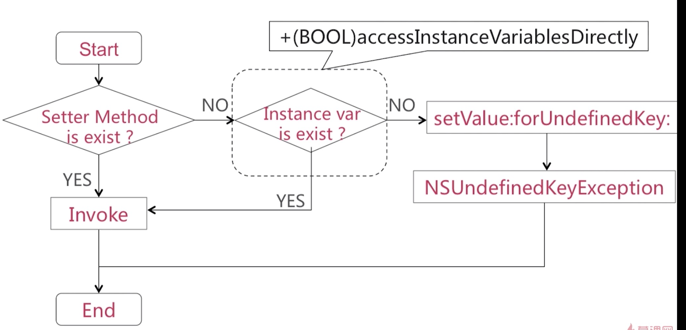

## KVC 

KVC是Key-value coding的缩写

    - (id)valueForKey:(NSString *)key;

    - (void)setValue:(id)value forKey:(NSString *)key;

通过上述两个方法，设置某一对象同名或者相似名称的一个实例变量的值

valueForKey实现逻辑

Accessor Method(访问器方法)：
* &lt;getKey>
* &lt;key>
* &lt;isKey>

访问器方法涉及到一个相似的概念，满足以上三种形式都可以认为该方法存在。

Instance var
* _key
* _isKey
* key
* isKey

    + (BOOL)accessInstanceVariablesDirectly;

默认返回YES，表示如果没有找到Set<Key>方法的话，会按照_key，_iskey，key，iskey的顺序搜索成员，设置成NO就不这样搜索