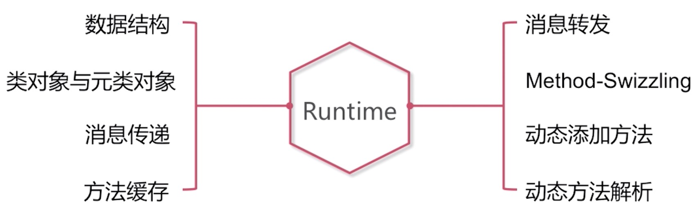
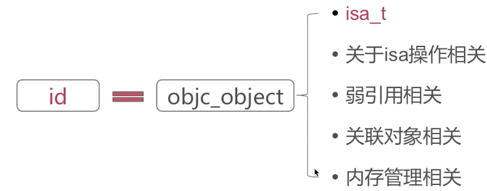
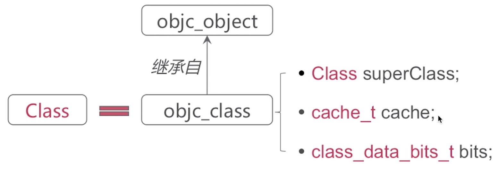
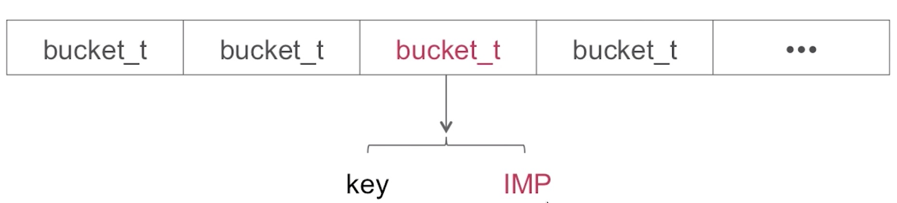
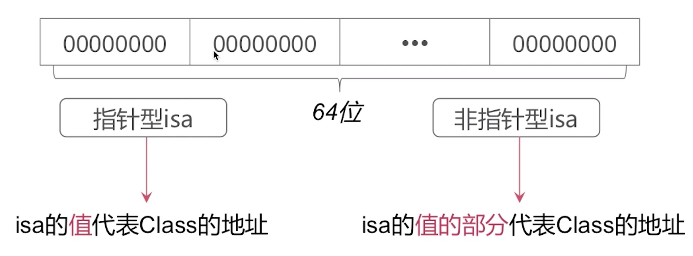
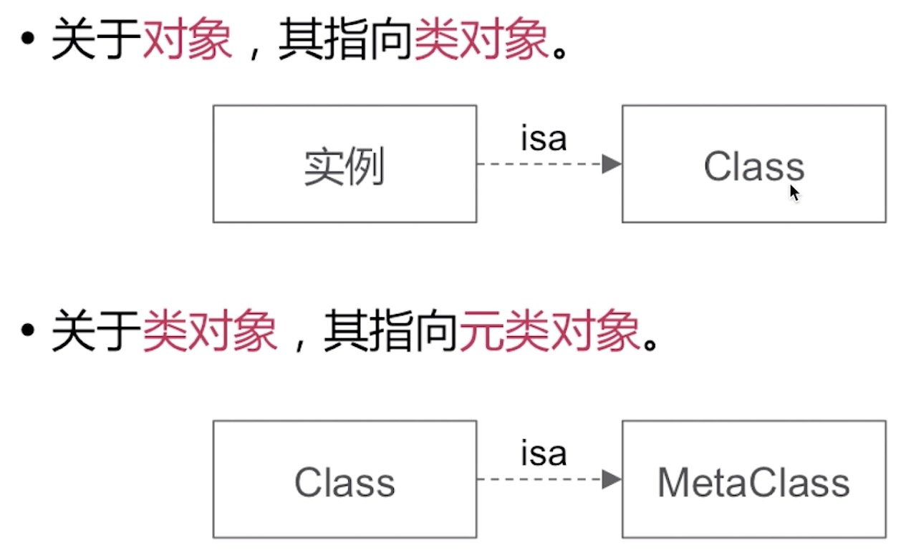
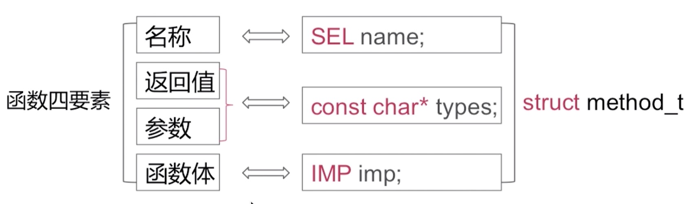
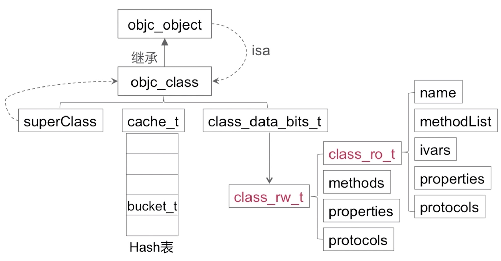

### 知识点

 

### 数据结构

* .objc_object
* .objc_class
* isa指针
* method_t

### 1.objc_object

我们平时使用的所有的对象都是id类型的，id类型的对象对应到runtime中，实际上就是objc_object这样的一个结构体。

### 2.objc_class

#### cache_t  方法缓存

* 用于`快速`查找方法执行函数
* 是可`增量扩展`的`哈希表`结构(存储的量增大的过程中会扩大它的内存空间，来支持更多的缓存)
* 是`局部性原理`的最佳应用(调用频次最高的方法放到缓存中)  

可以理解为一个数组来实现的，数组当中每一个对象都是一个bucket_t结构体，bucket_t有两个成员变量，一个key,一个IMP。key对应于OC语言的selector

#### class\_data\_bits_t
变量，属性，方法

### 3.isa指针

64位系统，8个字节

32位系统，4个字节

#### isa指向

### 3.method_t

### 4.整体数据结构

