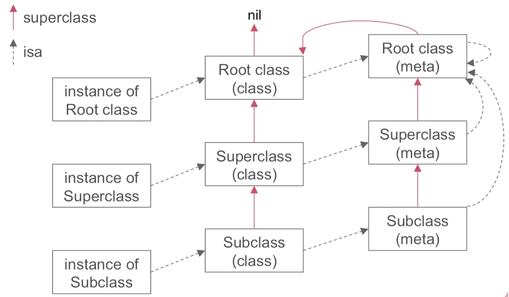
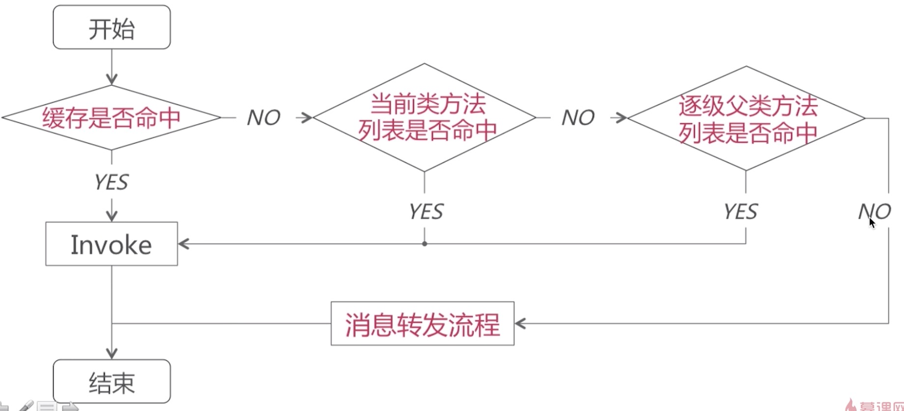
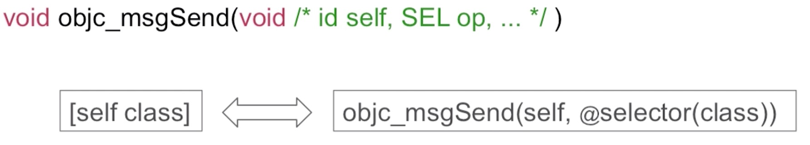
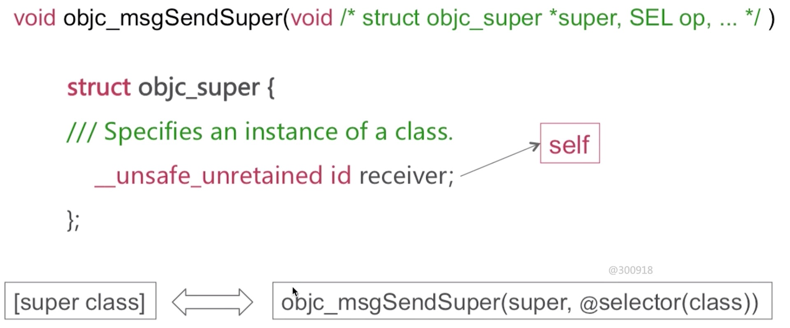
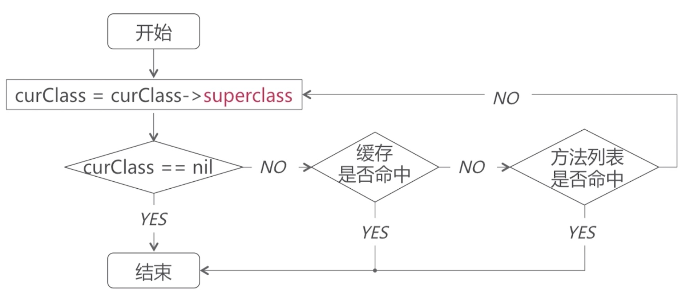

## 消息传递

对象、类对象、元类对象

* 类对象存储实例方法列表等信息
* 元类对象存储类方法列表等信息

注意点：

* 类对象和元类对象都是继承自objc_object
* 元类对象的isa指针指向根元类
* 根元类对象的superclass指针指向根类对象(当我们在元类方法列表里面找类方法，没有查找到的时候，会去实例方法列表查找)

### 消息传递

消息传递，实际上转化成了函数调用，这一步骤发生在编译器层面

super关键字，经过编译器编译之后会变成objc_super这样一个结构体类型的结构体指针，这个结构体里面的成员变量receiver就是当前对象。

#### 缓存查找
哈希查找
给定值是SEL,目标值是对应bucket_t中的IMP

#### 在当前类中查找
* 对于已排序好的列表，采用二分查找算法查找方法对应执行函数
* 对于没有排序的列表，采用一般遍历查找方法对应执行函数

#### 父类逐级查找
