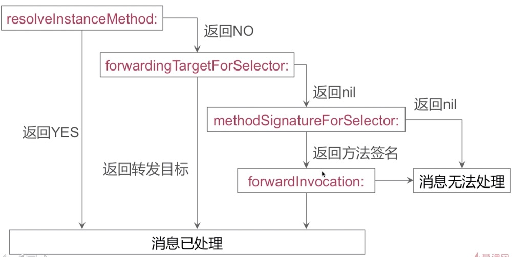

## 消息转发

### 转发步骤：

第一步，动态给当前对象添加一个方法的实现
第二步，将该消息转发给一个具有同名方法的对象
第三步，手动将相应方法切换给备用响应对象

### 第二步和第三步的区别:

>第三步的消息转发机制本质上跟第二步是一样的都是切换接受消息的对象，但是第三步切换响应目标更复杂一些，第二步里面只需返回一个可以响应的对象就可以了，第三步还需要手动将响应方法切换给备用响应对象。
第三步会有一个NSInvocation对象，这个NSInvocation对象保存了这个方法调用的所有信息，包括Selector名，参数和返回值类型，最重要的是有所有参数值，可以从这个NSInvocation对象里拿到调用的所有参数值。

### NSInvocation

#### 1.NSInvocation的作用
封装了方法调用对象、方法选择器、参数、返回值等，可以给对象发送一个参数大于两个的消息

#### 2.优势
在iOS 中可以直接调用某个对象的消息的方法有两种
* 1：performSelector：withObject： 这种类型的方法最多只能有两个参数
* 2：NSInvocation，它可以设置多个参数；