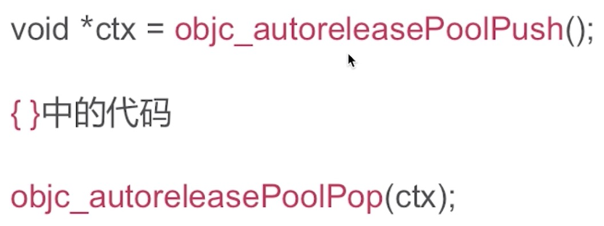
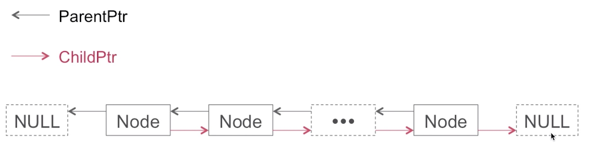
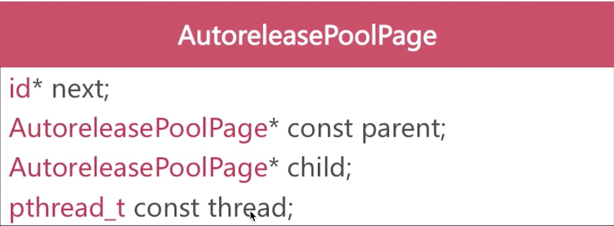

## 自动释放池

### AutoreleasePool的实现原理是怎样的？

编译器会将@autoreleasepool{}改写为：

### 数据结构

* 是以栈为节点通过双向链表的形式组合而成
* 是和线程一一对应的

双向链表

* 每个AutoreleasePoolPage对象占用4096字节内存，除了用来存放它内部的成员变量，剩下的空间用来存放autorelease对象的地址

* 所有的AutoreleasePoolPage对象通过双向链表的形式连接在一起

* 调用push方法会将一个POOL_BOUNDARY入栈，并且返回其存放的内存地址

* 调用pop方法时传入一个POOL_BOUNDARY的内存地址，会从最后一个入栈的对象开始发送release消息，直到遇到这个POOL_BOUNDARY

* id *next指向了下一个能存放autorelease对象地址的区域

#### Runloop和Autorelease

OS在主线程的Runloop中注册了2个Observer
* 第1个Observer监听了kCFRunLoopEntry事件，会调用objc_autoreleasePoolPush()
* 第2个Observer
  * 监听了kCFRunLoopBeforeWaiting事件，会调用objc_autoreleasePoolPop()、objc_autoreleasePoolPush()
  * 监听了kCFRunLoopBeforeExit事件，会调用objc_autoreleasePoolPop()

### 总结

* 在当次runloop将要结束的时候调用AutoreleasePoolPage::pop()
* 多次嵌套就是多次插入哨兵对象
* 在for循环中alloc图片数据等内存消耗较大的场景手动插入autoreleasePool