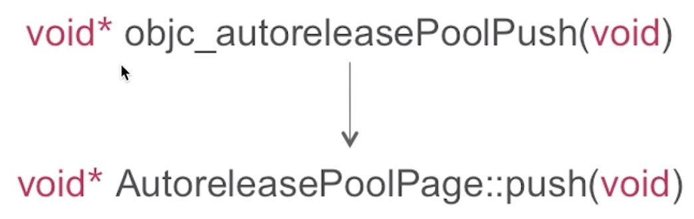
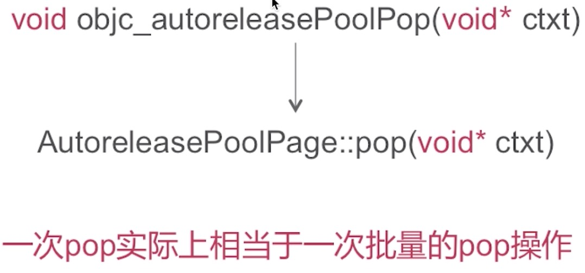

## 自动释放池

### AutoreleasePool的实现原理是怎样的？

编译器会将@autoreleasepool{}改写为：

objc_autoreleasePoolPush的内部实现

objc_autoreleasePoolPop的内部实现

### 数据结构

* 是以栈为节点通过双向链表的形式组合而成
* 是和线程一一对应的

双向链表

### 总结

* 在当次runloop将要结束的时候调用AutoreleasePoolPage::pop()
* 多次嵌套就是多次插入哨兵对象
* 在for循环中alloc图片数据等内存消耗较大的场景手动插入autoreleasePool