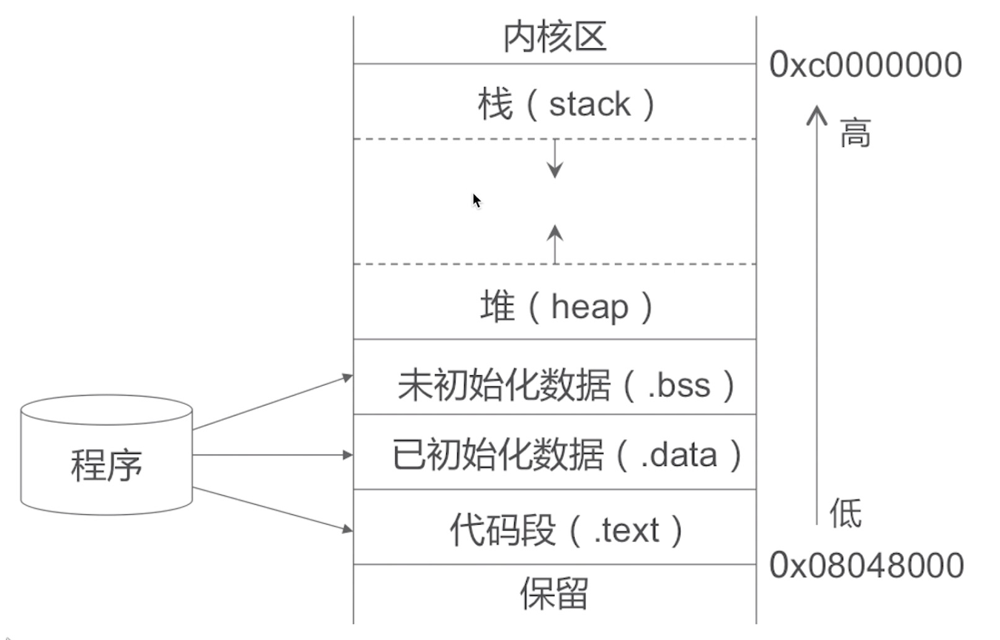

## 内存管理方案补充

### TaggedPointer

* 在64bit开始，iOS引入了Tagged Pointer技术，用于优化NSNumber、NSDate、NSString等小对象存储
* 在没有使用Tagged Pointer之前，NSNumer等对象需要动态分配内存、维护引用技术等，NSNumber指针存储的是堆中NSNumber对象的地址值
* 使用Tagged Pointer之后，NSNumber指针里面存储的数据变成了：Tag + Data，也就是将数据存储在了指针中
* 当指针不够存储数据时，才会使用动态分配内存的方式来存储数据
* objc_msgSend能识别Tagged Pointer，比如NSNumber的intValue方法，直接从指针提取数据，节省了以前的调用开销
* 如何判断一个指针是否为Tagged Pointer？
  * iOS平台，最高有效位是1（第64bit）
  * Mac平台，最低有效位是1

一个类对象指针需要8个字节的内存空间，因为所有的对象是集成在NSObject。NSObject类对象需要8个指针，NSObject实例对象需要16个字节存储空间，因为iOS需要占用8个字节，再加上`内存对齐`为16个字节.

Tagged Pointer指针的值不再是地址了，而是真正的值。所以，实际上它不再是一个对象了，它只是一个披着对象皮的普通变量而已！所以，它的内存并不存储在堆中，也不需要malloc和free。
在内存读取上有着3倍的效率（以前是寻址->发消息->获取值，现在直接获取值），创建时比以前快106倍。

可在本章节[NSObject占用多少内存](/Chapter18/c1.md)查看`内存对齐`相关知识

### NONPOINTER_ISA

在`arm64`架构之前，isa就是一个普通的指针，存储着Class、Meta-Class对象的内存地址

从`arm64`架构开始，对isa进行了优化，变成了一个共用体（union）结构，还使用位域来存储更多的信息

用 64 bit 存储一个内存地址显然是种浪费，毕竟很少有那么大内存的设备。于是可以优化存储方案，用一部分额外空间存储其他内容。isa 指针第一位为 1 即表示使用优化的 isa 指针，这里列出不同架构下的 64 位环境中 isa 指针结构：

* nonpointer
  * 0，代表普通的指针，存储着Class、Meta-Class对象的内存地址
  * 1，代表优化过，使用位域存储更多的信息
* has_assoc
  * 是否有设置过关联对象，如果没有，释放时会更快
* has_cxx_dtor
  * 是否有C++的析构函数（.cxx_destruct），如果没有，释放时会更快
* shiftcls
  * 存储着Class、Meta-Class对象的内存地址信息
* magic
  * 用于在调试时分辨对象是否未完成初始化
* weakly_referenced
  * 是否有被弱引用指向过，如果没有，释放时会更快
* deallocating
  * 对象是否正在释放
* extra_rc
  * 里面存储的值是引用计数器减1
* has_sidetable_rc
  * 引用计数器是否过大无法存储在isa中
  * 如果为1，那么引用计数会存储在一个叫SideTable的类的属性中

### 三种内存管理方式选择

TaggedPointer：NSNumber、NSDate、NSString等小对象存储

NONPOINTER_ISA：引用技术不大的对象

散列表：引用技术过大，无法在NONPOINTER_ISA中存储，使用散列表管理