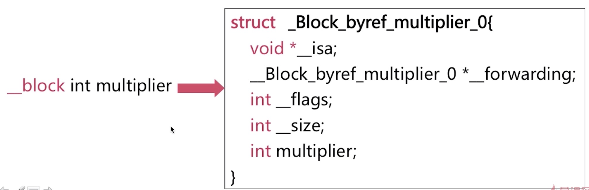
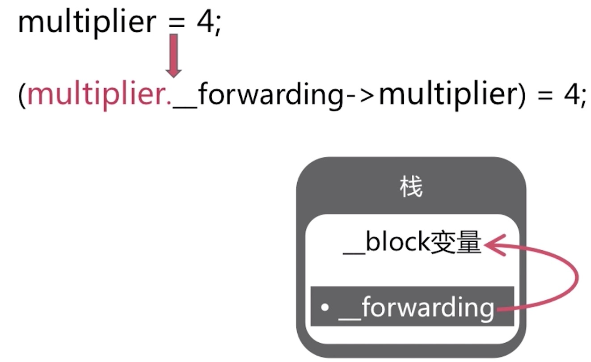

### 什么是Block？

Block是将`函数`及其`执行上下文`装起来的`对象`。

Block集成自NSObject
`Block`->`NSBlock`->`NSObject`

### 数据结构

使用`【clang-rewrite-objc file.m】`查看编译之后的文件内容

    struct __block_imp {
        void *isa;//isa指针，Block是对象的标志
        int Flags;
        int Reserved;
        void *FuncPtr;//函数指针
    }

### 什么是Block的调用？

Block的调用即是`函数的调用`。

### 截获变量

为了保证block内部能够正常访问外部的变量，block有个变量`捕获机制`，Block的内部会专门新增一个成员来存储外面那个值。
 
 * 局部变量
   * 基本数据类型
   * 对象类型
 * 静态局部变量
 * 全局变量
 * 静态全局变量

截获原则：

* 对于`基本数据`类型的`局部变量`截获其值
* 对于`对象`类型的局部变量`连同所有权修饰符`一起截获
* 以`指针形式`截获局部静态变量
* `不截获`全局变量、静态全局变量,直接访问

#### block捕获self

OC里面所有的方法在转成底层的C/C++数据结构后，都会默认增加两个参数`self`和`cmd`,self就是指当前对象,cmd指当前方法的selector.

个人猜测，在方法里调用self去获取当前对象的属性或者执行当前当前对象的其它方法时，使用的self就是默人传入的参数self,因此self也是一个局部变量。

在block中使用成员变量的时候，底层代码实际是`self->成员变量`，因此self也会被block捕获。

### __block修饰符

`一般情况下`，对被截获变量进行赋值操作需要添加`__block修饰符`
基本数据类型的局部变量经过__block修饰的变量变成了`对象`
  

局部变量的赋值经过编译器编译之后会发生如下转换
栈上的变量__forwarding指针指向自己

