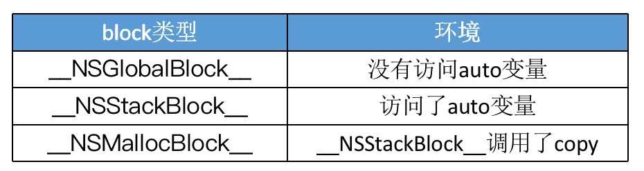

## Block本质

Block是将`函数`及其`执行上下文`装起来的`对象`。

Block集成自NSObject，其继承关系是：`Block`->`NSBlock`->`NSObject`。

使用`【clang-rewrite-objc file.m】`查看编译之后的文件内容

    struct __block_imp {
        void *isa;//isa指针，Block是对象的标志
        int Flags;
        int Reserved;
        void *FuncPtr;//函数指针
    }

## Block的调用

Block的调用即是`函数的调用`。

## Block类型

1. Block不访问外界变量（包括栈中和堆中的变量）,Block 既不在栈又不在堆中，在代码段中，ARC和MRC下都是如此。此时为全局块。
2. Block访问外界变量
   * MRC 环境下：访问外界变量的 Block 默认存储栈中。
   * ARC 环境下：访问外界变量的 Block 默认存储在堆中（实际是放在栈区，然后ARC情况下自动又拷贝到堆区），栈区block自动释放。

##### ARC下，访问外界变量的 Block为什么要自动从栈区拷贝到堆区呢？
* 在ARC的Block是配置在栈上的，所以返回函数调用方时，Block变量作用域就结束了，Block会被废弃,这种情况编译器会自动完成复制。
* 在非ARC情况下则需要开发者调用copy方法手动复制，否则栈区block离开作用域就会自动释放。

##### Block的Copy操作

在`MRC`情况下，对栈上的block进行copy操作，会产生内存泄漏

在`ARC`环境下，编译器会根据情况自动将栈上的block复制到堆上，比如以下情况：
* block作为函数返回值时
* 将block赋值给__strong指针时
* block作为Cocoa API中方法名含有usingBlock的方法参数时（枚举遍历）
* block作为GCD API的方法参数时

