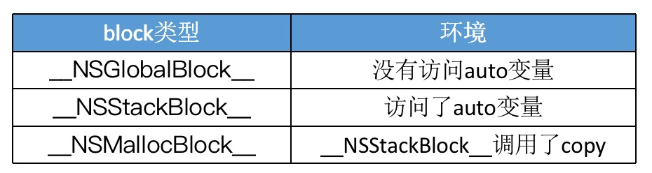
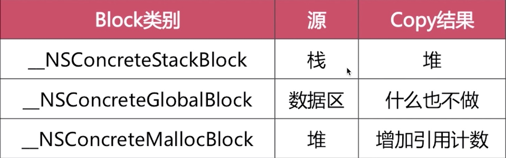

## Block的内存管理

_NSGlobalBlock_是存在数据局域的，OC中函数也是存在该区域，因此可以把_NSGlobalBlock_理解成一个函数。

_NSStackBlock_只有在MRC情况下才会出现，ARC下，Block只会存在堆或全局区。

### Block的Copy操作

在`MRC`情况下，对栈上的block进行copy操作，会产生内存泄漏

在`ARC`环境下，编译器会根据情况自动将栈上的block复制到堆上，比如以下情况：
* block作为函数返回值时
* 将block赋值给__strong指针时
* block作为Cocoa API中方法名含有usingBlock的方法参数时（枚举遍历）
* block作为GCD API的方法参数时

auto为基本数据类型

auto为对象类型

当block内部访问了对象类型的auto变量时，如果block是在`栈`上，将`不会`对auto变量产生强引用。

### __block修饰符

* __block可以用于解决block内部无法修改auto变量值的问题
* __block不能修饰全局变量、静态变量（static）
* 编译器会将__block变量包装成一个对象
  
block调用一个被__block修饰过的局部变量

    __block int age = 10;
    void (^block)(void) = ^{
        NSLog(@"----%d",age); //20
    };
    block();

以上代码编译为底层C语言

      struct __main_block_impl_0 {
        struct __block_impl impl;
        struct __main_block_desc_0* Desc;
        __Block_byref_age_0 *age; // by ref
        //构造方法
        __main_block_impl_0(void *fp, struct __main_block_desc_0 *desc, __Block_byref_age_0 *_age, int flags=0) : age(_age->__forwarding) {
          impl.isa = &_NSConcreteStackBlock;
          impl.Flags = flags;
          impl.FuncPtr = fp;
          Desc = desc;
        }
      };

age会被包装成一个对象

    struct __Block_byref_age_0 {
      void *__isa;
    __Block_byref_age_0 *__forwarding;
     int __flags;
     int __size;
     int age;
    };

#### 栈上__block变量的Copy

* 当对__block变量做copy操作后，在堆上会产生一个__block变量，和它是完全一致的，但是是两块内存空间
* copy后栈上的__forwarding指针指向的是堆上的__block变量，堆上的__forwarding指针指向的是其自身

被__block修饰的变量会被编译器包装成一个对象，对象内部有一个__forwarding指针，还有变量自己，__forwarding指针默认指向自己。block拷贝后，堆上也会出现一个被包装的对象，堆上对象的__forwarding指向自己，栈上对象的__forwarding指向堆上的__block变量，因此修改栈上的变量还是修改堆上的变量，修改的都是堆上的变量。

#### __block修饰的对象类型

#### __block的内存管理

如果block是在栈上，将不会对auto变量产生强引用

当block被copy到堆时
* 会调用block内部的copy函数
* copy函数内部会调用_Block_object_assign函数
* _Block_object_assign函数会对__block变量形成强引用（retain）

#### __forwarding存在的意义

不论在任何内存位置，都可以顺利的访问同一个__block变量