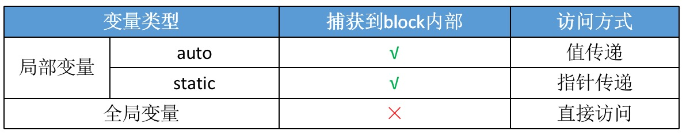

## Block捕获变量

为了保证block内部能够正常访问外部的变量，block有个变量`捕获机制`，Block的内部会专门新增一个成员来存储外面那个值。
 
 * 局部变量
   * 基本数据类型
   * 对象类型
 * 静态局部变量
 * 全局变量
 * 静态全局变量

截获原则：

* 对于`基本数据`类型的`局部变量`截获其值
* 对于`对象`类型的局部变量`连同所有权修饰符`一起截获
* 以`指针形式`截获局部静态变量
* `不截获`全局变量、静态全局变量,直接访问

#### 个人理解：

>可以把在block里使用的外部变量理解为函数的参数，因为block本身就是对函数的封装。
>如果是全局变量，在函数内部直接使用就可以，不需要在函数内部去新开辟内存空间捕获它。
>如果是静态局部变量，静态局部变量的只是存储位置发生了变化，作用域不变。因此离开作用域后就无法访问到这个变量，所以block内部需要去开辟一块存储空间去捕获这个变量。因为是静态的，只会被初始化一次，因此可以直接去捕获它的地址，通过它的地址去使用这个值。
>如果是局部非静态变量，即auto局部变量。这种变量除了作用域就会马上释放，因此需要在block存储空间开辟一块内存捕获该变量。如果是基本数据类型，那么直接捕获该值，赋值到新的内存。如果是对象，那么就需要去判断当前对象是strong还是weak引用，如果是strong，那么就对它进行一次强引用，如果是weak，就进行一次弱引用。

#### block捕获self

OC里面所有的方法在转成底层的C/C++数据结构后，都会默认增加两个参数`self`和`cmd`,self就是指当前对象,cmd指当前方法的selector.

个人猜测，在方法里调用self去获取当前对象的属性或者执行当前当前对象的其它方法时，使用的self就是默人传入的参数self,因此self也是一个局部变量。

在block中使用成员变量的时候，底层代码实际是`self->成员变量`，因此self也会被block捕获。

## __block修饰符

`一般情况下`，对被截获变量进行赋值操作需要添加`__block修饰符`
基本数据类型的局部变量经过__block修饰的变量变成了`对象`

* __block可以用于解决block内部无法修改auto变量值的问题
* __block不能修饰全局变量、静态变量（static）
* 编译器会将__block变量包装成一个对象
* __block修改变量：age->__forwarding->age
* __Block_byref_age_0结构体内部地址和外部变量age是同一地址

  
block调用一个被__block修饰过的局部变量

    __block int age = 10;
    void (^block)(void) = ^{
        NSLog(@"----%d",age); //20
    };
    block();

以上代码编译为底层C语言

      struct __main_block_impl_0 {
        struct __block_impl impl;
        struct __main_block_desc_0* Desc;
        __Block_byref_age_0 *age; // by ref
        //构造方法
        __main_block_impl_0(void *fp, struct __main_block_desc_0 *desc, __Block_byref_age_0 *_age, int flags=0) : age(_age->__forwarding) {
          impl.isa = &_NSConcreteStackBlock;
          impl.Flags = flags;
          impl.FuncPtr = fp;
          Desc = desc;
        }
      };

age会被包装成一个对象

    struct __Block_byref_age_0 {
      void *__isa;
    __Block_byref_age_0 *__forwarding;
     int __flags;
     int __size;
     int age;
    };

#### 栈上__block变量的Copy

* 当对__block变量做copy操作后，在堆上会产生一个__block变量，和它是完全一致的，但是是两块内存空间
* copy后栈上的__forwarding指针指向的是堆上的__block变量，堆上的__forwarding指针指向的是其自身

被__block修饰的变量会被编译器包装成一个对象，对象内部有一个__forwarding指针，还有变量自己，__forwarding指针默认指向自己。block拷贝后，堆上也会出现一个被包装的对象，堆上对象的__forwarding指向自己，栈上对象的__forwarding指向堆上的__block变量，因此修改栈上的变量还是修改堆上的变量，修改的都是堆上的变量。

#### __block修饰的对象类型

1. 当__block变量在栈上时，不会对指向的对象产生强引用
2. 当__block变量被copy到堆时
   * 会调用__block变量内部的copy函数
   * copy函数内部会调用_Block_object_assign函数
   * _Block_object_assign函数会根据所指向对象的修饰符（__strong、__weak、__unsafe_unretained）做出相应的操作，形成强引用（retain）或者弱引用（注意：这里仅限于ARC时会retain，MRC时不会retain）
   * MRC环境下不会根据对象的修饰符引用，都是弱引用
3. 如果__block变量从堆上移除
   * 会调用__block变量内部的dispose函数
   * dispose函数内部会调用_Block_object_dispose函数
_Block_object_dispose函数会自动释放指向的对象（release）

#### __block的内存管理

如果block是在栈上，将不会对auto变量产生强引用

当block被copy到堆时
* 会调用block内部的copy函数
* copy函数内部会调用_Block_object_assign函数
* _Block_object_assign函数会对__block变量形成强引用（retain）

#### __forwarding存在的意义

不论在任何内存位置，都可以顺利的访问同一个__block变量

