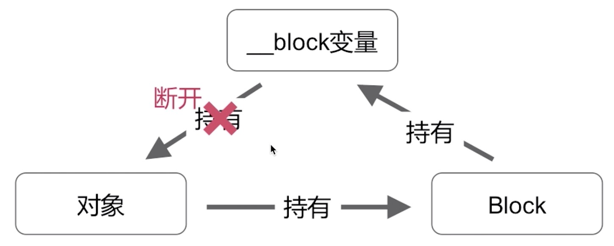

## 循环引用

    __block MCBlock* blockSelf = self;
    _blk = ^int(int num) {
        int result = num * blockSelf.var;
        blockSelf = nil;//解决方案，断环
        return result;
    }
    
    _blk(3);

* 在MRC下，不会产生循环引用
* 在ARC下，会产生循环引用

### Block产生循环引用的两种情况

* 1.当前block对当前对象的某一成员变量进行截获的话，那么这个block会对对应变量有一个强应用，而当前block又由于当前对象对其有一个强引用，就会产生一种自循环引用方式的一种循环引用问题，我们可以通过__weak来消除
* 2.如果我们定义了一个__block说明符的话，在ARC下也会产生循环引用。可以通过断环的方式去解决循环引用，但是有一个弊端，如果这个block一直不执行，那么循环引用一直存在

