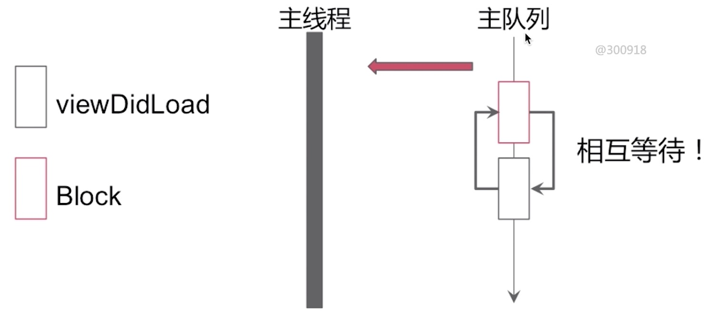
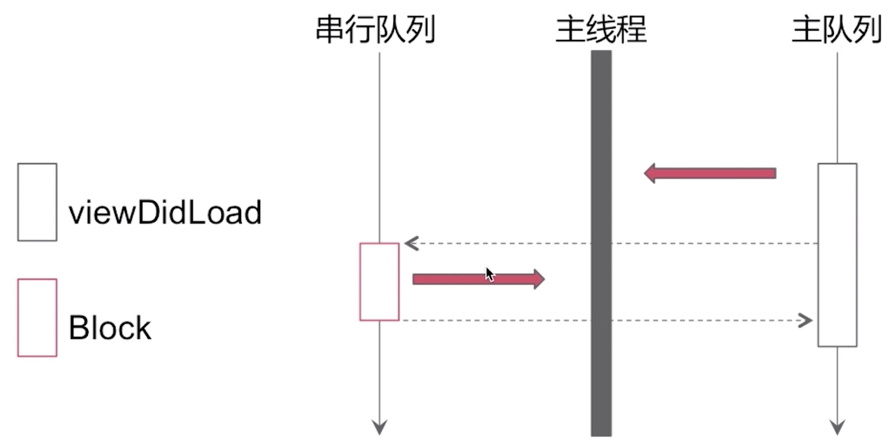

## GCD经典面试题

#### 面试题1：

    - (void)viewDidLoad {
        dispatch_sync(dispatch_get_main_queue(), ^{
            [self doSomething];
        });
    }

结果：死锁。 死锁原因：`队列引起的循环等待`

#### 面试题2：

    - (void)viewDidLoad {
        dispatch_sync(serialQueue, ^{
            [self doSomething];
        })
    }

结果：可正常执行

#### 面试题3：

    - (void)viewDidLoad {
        NSLog(@"1");
        dispatch_sync(global_queue, ^{
            NSLog(@"2");
            dispatch_sync(global_queue, ^{
                NSLog(@"3");
            });
            NSLog(@"4");
        });
        NSLog(@"5");
    }

结果：1 2 3 4 5

#### 面试题4：

    - (void)viewDidLoad {
        dispatch_async(global_queue, ^{
            NSLog(@"1");
            [self performSelector:@selector(printLog)
                    withObject:nil
                    afterDelay:0];
            NSLog(@"3");
        });
    }

    - (void)printLog {
        NSLog(@"2");
    }

输出结果：1 3 
解析：2不会打印，performSelector任务需要提交到runloop才能执行，子线程runloop不会自动开启