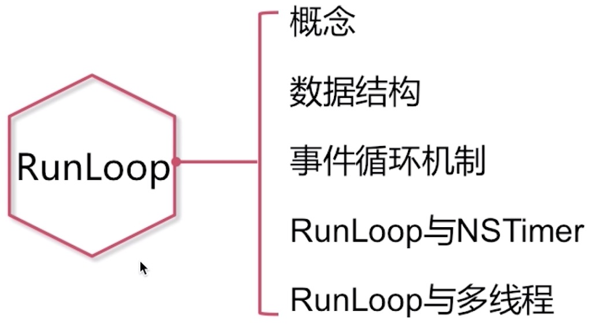
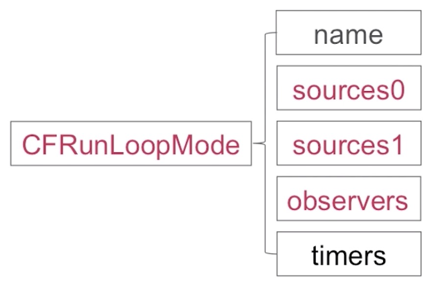
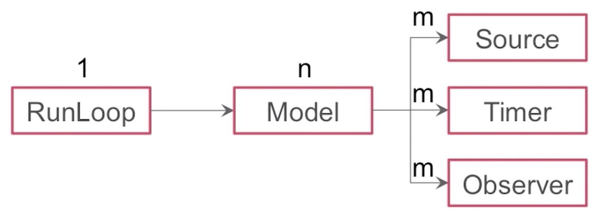
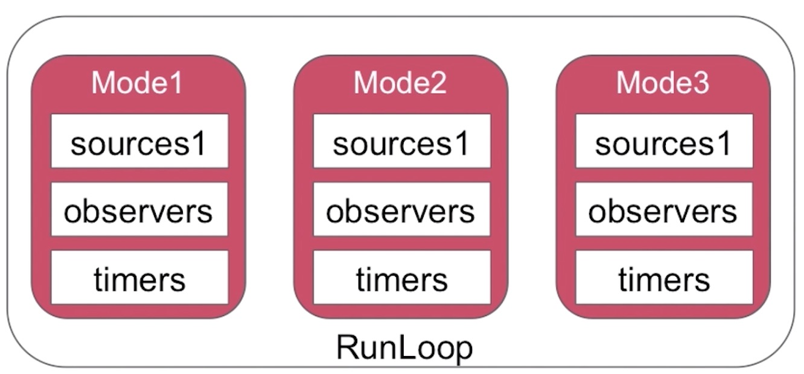

### 知识点

## 什么是RunLoop?

RunLoop是通过内部维护的`事件循环`来对`事件/消息进行管理`的一个对象。

事件循环

* 没有消息需要处理时，休眠以避免资源占用
* 有消息需要处理时，立刻被唤醒

应用范畴
* 定时器（Timer）、PerformSelector
* GCD Async Main Queue
* 事件响应、手势识别、界面刷新
* 网络请求
* AutoreleasePool

## 数据结构

NSRunLoop是CFRunLoop的封装，提供了面向对象的API，主要包括以下三个部分

* CFRunLoop
* CFRunLoopMode
* Source/Timer/Observer

>*pthread：代表了线程，runloop和线程是一一对应的关系
currentMode：CFRunLoopMode
modes：NSMutableSet<`CFRunLoopmode*`>
commonModes：NSMutableSet<NSString*>
commonModesItems：是一个集合，在这个集合当中，会有多个元素，包含多个Observer,多个Timer，多个Source

>name：name是一个字符串，对应的就是runloop它的mode的名称，如NSDefaultRunLoopMode
sources0,sources1：MutableSet
observers,timers：MutableArray 

CFRunLoopSource

* sources0
  需要手动唤醒线程
* sources1
  `具备唤醒线程的能力`

CFRunLoopTimer

基于事件的定时器

CFRunLoopObserver

观察时间点

* kCFRunLoopEntry （即将进入loop）
* kCFRunLoopBeforeTimers  （即将处理timer）
* kCFRunLoopBeforeSources  （即将处理source）
* kCFRunLoopBeforeWaiting  （即将进入休眠）
* kCFRunLoopAfterWaiting   （刚从休眠中唤醒）
* kCFRunLoopExit   （即将推出loop）

各个数据结构之间的关系

RunLoop的Mode

CommonMode的特殊性

NSRunLoopCommonModes
* CommonMode`不是实际存在的`一种Mode
* 是同步Source/Timer/Observer到多个Mode中的一种`技术方案`

### RunLoop的mode

* 一个RunLoop包含若干个Mode，每个Mode又包含若干个Source0/Source1/Timer/Observer
* RunLoop启动时只能选择其中一个Mode，作为currentMode
* 如果需要切换Mode，只能退出当前Loop，再重新选择一个Mode进入
  * 不同组的Source0/Source1/Timer/Observer能分隔开来，互不影响
* 如果Mode里没有任何Source0/Source1/Timer/Observer，RunLoop会**立马退出**
