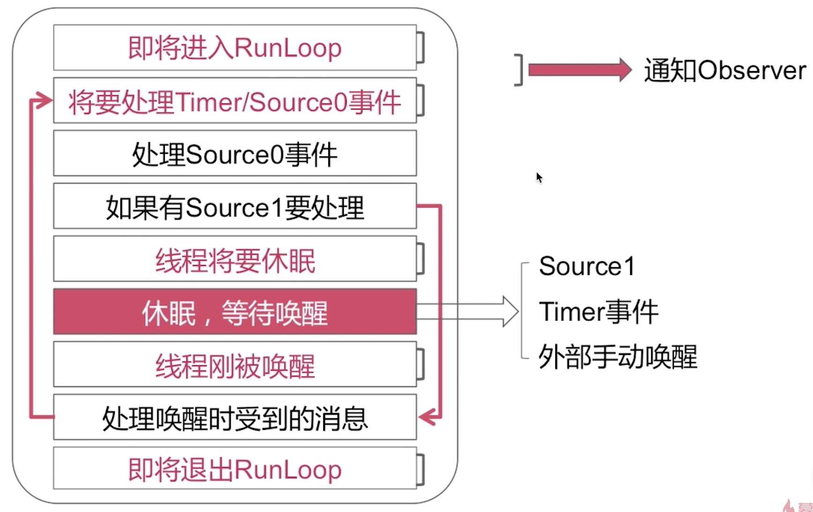

## 事件循环的实现机制

## RunLoop在实际开中的应用

#### 控制线程生命周期（线程保活）

线程不会死,也可以执行test中的代码。但是run方法里的end也不会打印,因为runloop已经休眠了。由于任务永远不会执行完毕，所以哪怕是VC释放了，线程也不会释放。

    - (void)viewDidLoad {
        [super viewDidLoad];

        self.thread = [[MJThread alloc] initWithTarget:self selector:@sel(run) obj:nil];
        [self.thread start];
    }

    - (void)touchesBegan:(NSSet<UITouch *> *)touches withEvent:(UIEvent *)event
    {
        [self performSelector:@selector(test) onThread:self.thread withObject:nil waitUntilDone:NO];
    }

    // 子线程需要执行的任务
    - (void)test
    {
        NSLog(@"%s %@", __func__, [NSThread currentThread]);
    }

    - (void)run {
        NSLog(@"%@----begin----", [NSThread currentThread]);
        [[NSRunLoop currentRunLoop] addPort:[[NSPort alloc] init] forMode:NSDefaultRunLoopMode];
        [[NSRunLoop currentRunLoop] run];
        NSLog(@"%@----end----", [NSThread currentThread]);
    }

#### 解决NSTimer在滑动时停止工作的问题

#### 监控应用卡顿

#### 性能优化
