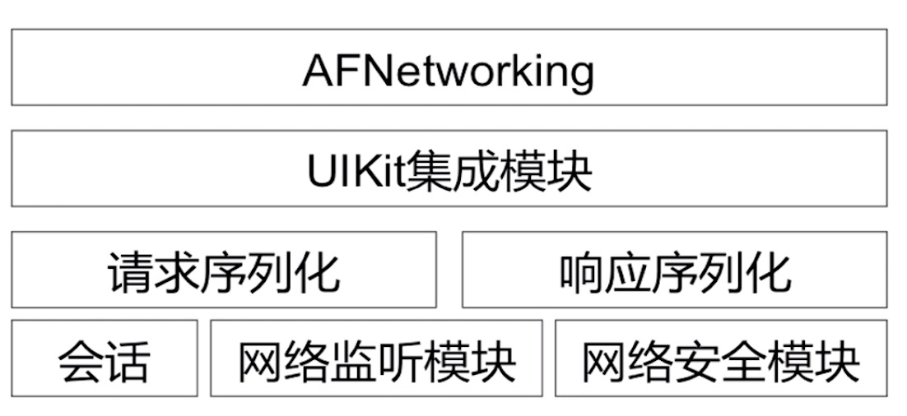
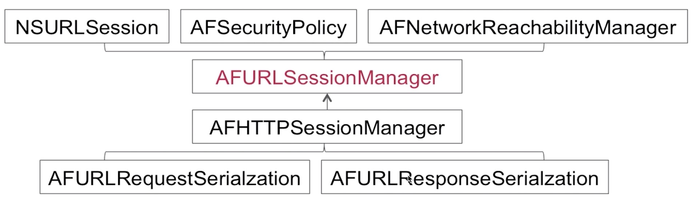

## AFNetworking

### 架构简图

### 主要类

###### AFURLSessionManager负责工作
* 创建和管理NSURLSession、NSURLSessionTask
* 实现NSURLSessionDelegate等协议的代理方法
* 引入AFSecurityPolicy保证请求安全
* 引入AFNetworkReachabilityManager监控网络状态