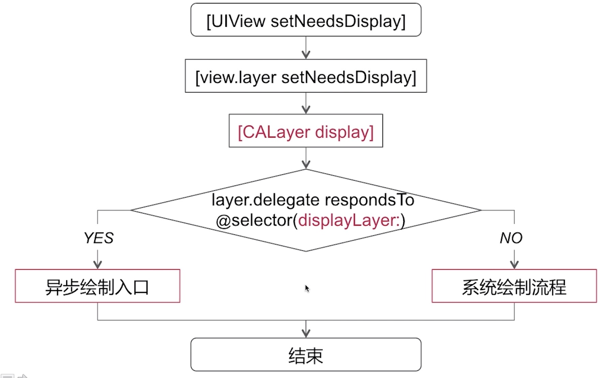
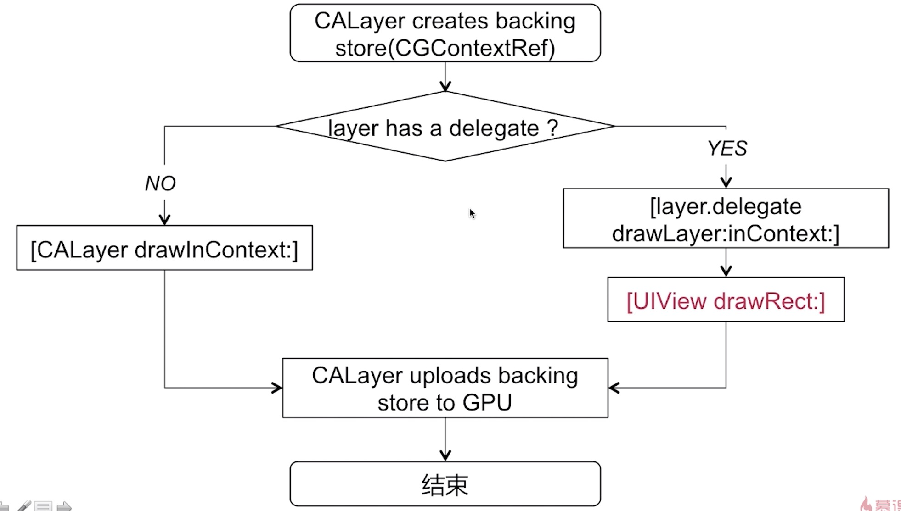
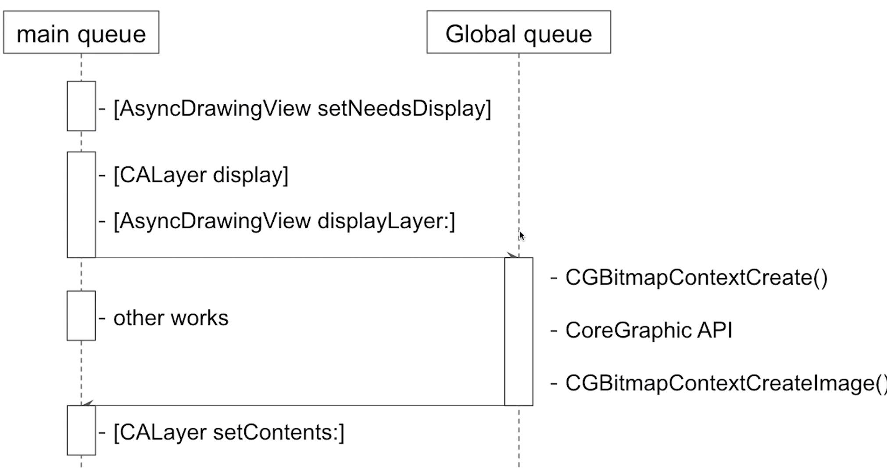

## UI绘制原理

* 1、当我们调用【UIView setNeedsDisplay】这个方法时，其实并没有立即进行绘制工作，系统会立即调用CALayer的同名方法，并且在当前layer上打上一个标记，然后会在当前runloop将要结束的时候调用CALayer display  这个方法，然后进入视图的真正绘制过程

* 2、在【CALayer display】这个方法的内部实现中会判断这个layer的delegate是否响应displaylayer 这个方法，如果不响应这个方法，就回到系统绘制流程中，如果响应这个方法，那么就会为我们提供异步绘制的入口

### 系统的绘制流程

### 异步绘制

系统帮我们开了一个口子，如果我们实现了[layer.delegate displayLayer:]这个方法，就可以进入异步绘制的流程当中

- [layer.delegate displayLayer:]
  - 代理负责生产对应的bitmap
  - 设置该bitmap作为layer.contents属性的值

* 1、假如我们在某一时机调用了【view setNeedsDisplay】这个方法，系统会在当前runloop将要结束的时候调用【CALayer display】方法，然后如果我们这个layer代理实现了displaylayer这个方法

* 2、然后切换到子线程去做位图的绘制，主线程可以去做其他的操作

* 3、在自吸纳成中创建一个位图的上下文，然后通过CoregraphIC API 可以做当前UI控件的一些绘制工作，最后再通过CGBitmapContextCreateImage（）函数来生成一直CGImage图片

* 4、最后回到主线程来提交这个位图，设置layer的contents 属性，这样就完成了一个UI控件的异步绘制
