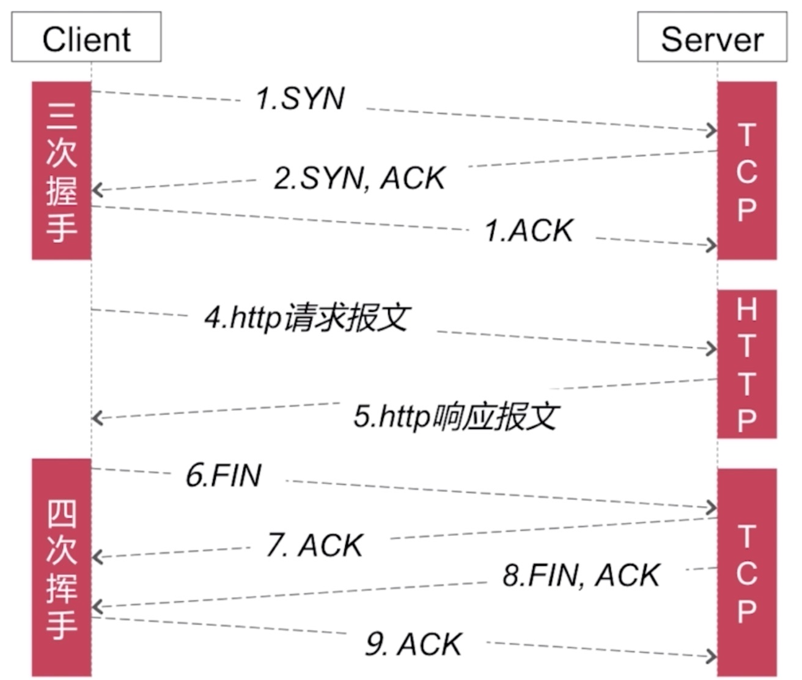
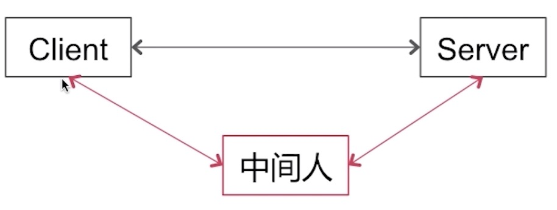

## Http

### Http的请求方式
* get
* post
* head
* put
* delete
* options

### Get和Post方式的区别

GET：获取资源
* 安全的
* 幂等的
* 可缓存的

POST：处理资源
* 非安全的
* 非幂等的
* 不可缓存的

##### 安全性
不应该引起Server端的任何状态变化

##### 幂等性
同一个请求方法执行多次和执行一次的效果完全相同

##### 可缓存性
请求是否可以被缓存

### Http建立连接过程

### Http特点
* 无连接
* 无状态

##### 持久连接
头部字段：
* Connection : keep-alive
* time : 20 (20秒以内连接有效)
* max : 10 （这条连接最多可以发送10次请求）

怎样判断一个请求是否结束的？
* `content-length` : 1024 (客户端根据接收数据的字节数是否达到1024)
* `chunked`，最后会会有一个空的chunked

##### Charles抓包原理是怎样的？

`中间人攻击`

