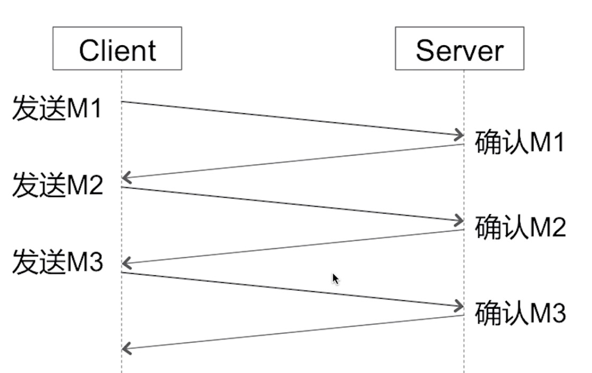
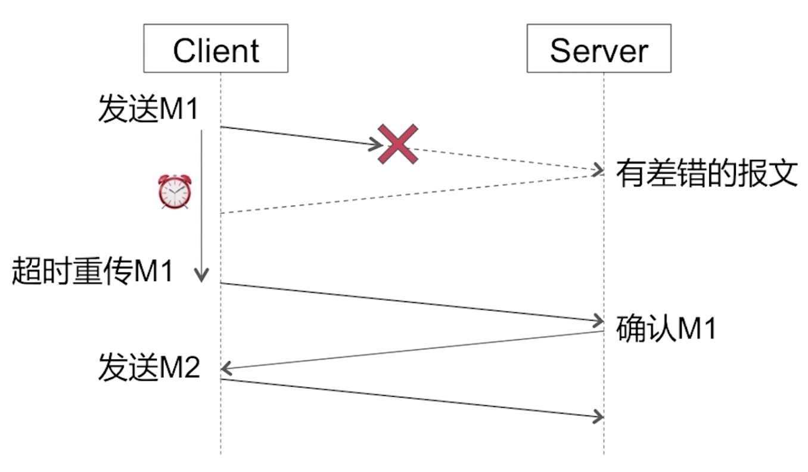
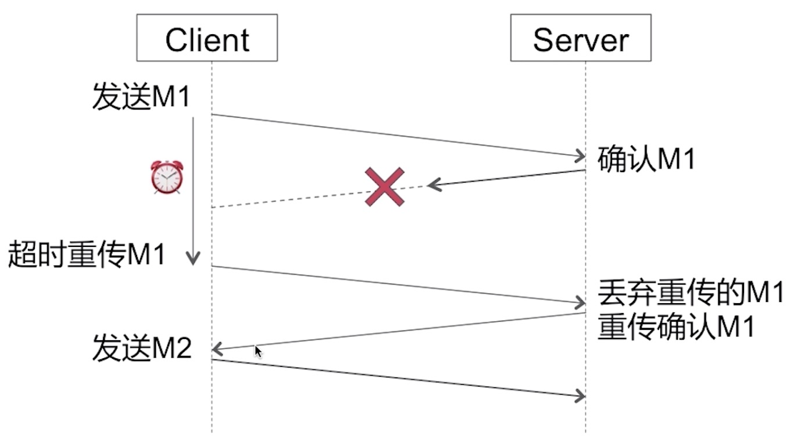
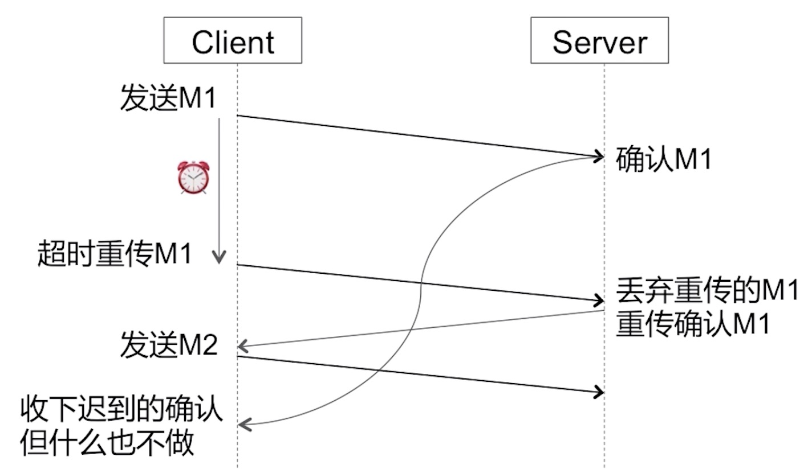

## TCP/UDP 

### UDP

特点：
* 无连接
* 尽最大努力交付（不保证可靠传输的）
* 面向报文（既不合并，也不拆分，就是数据服务端发送的数据在传输过程中会原封不动的发送给客户端，不会出现TCP的粘包）

功能：
* 复用
* 分用
* 差错检测

### TCP

特点：
* 面向连接
* 可靠传输
* 面向字节流（TCP会自动决定每次发送额报文的长度，而不是客户端发送多少就发多少，TCP会自己组装拆分）
* 流量控制
* 拥塞控制

#### 为什么要进行三次握手？而不是两次？

>如果是两次，那么可能会发生多次连接的情况。举个例子:当客户端发送一个请求建立连接的报文给服务端，该报文在发送过程中超时，客户端会启用超时重发策略，重新发送一次请求建立连接的报文。服务端收到该报文后，会回复给客户端一个确认报文，这时我们的TCP连接已经建立了。假设刚才超时的报文在建立连接后又收到了，那么服务端就会认为客户端又要建立一次TCP连接。通过三次握手就可以避免这样的情况。

#### 四次挥手

>因为TCP全双工的特点，即客户端和服务端，既是发送器，也是接收器。因此需要确认双方面的连接释放。

#### TCP是如何保证可靠传输的

TCP是通过`停止等待协议`来保证可靠传输的，`停止等待协议`有以下四个特点

###### 1.无差错情况
每次请求都会被服务端确认

###### 2.超时重传

###### 3.确认丢失

###### 4.确认迟到

