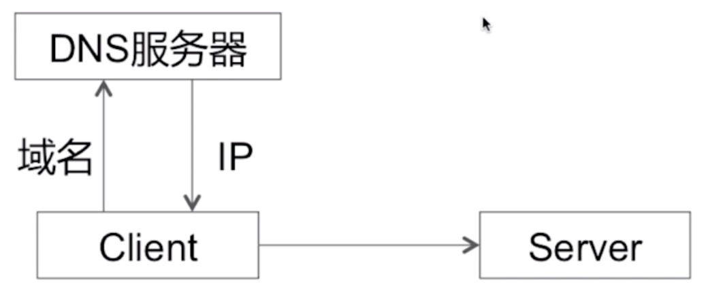
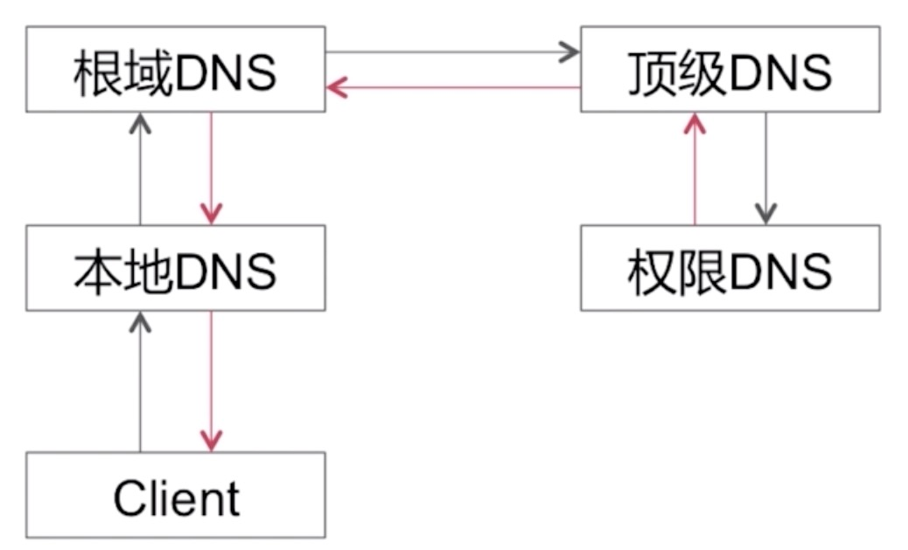
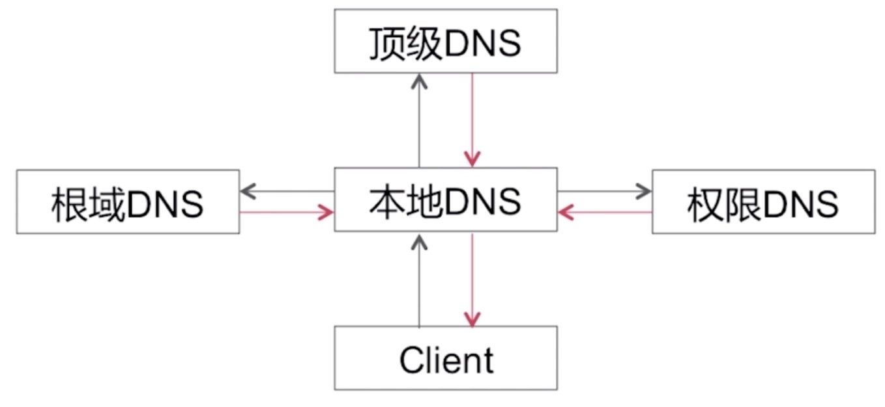
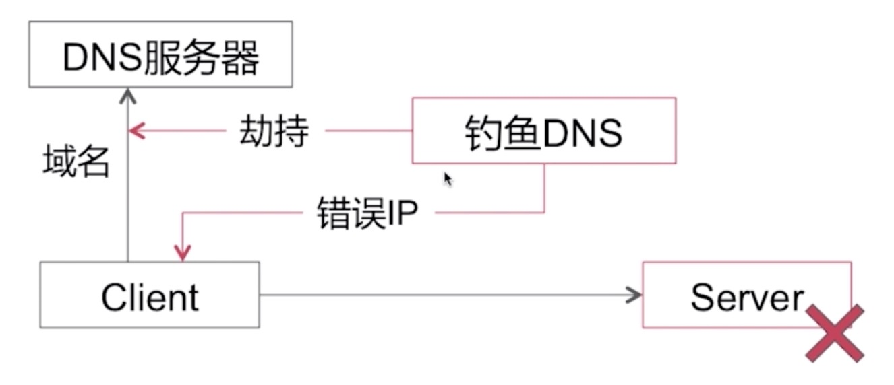
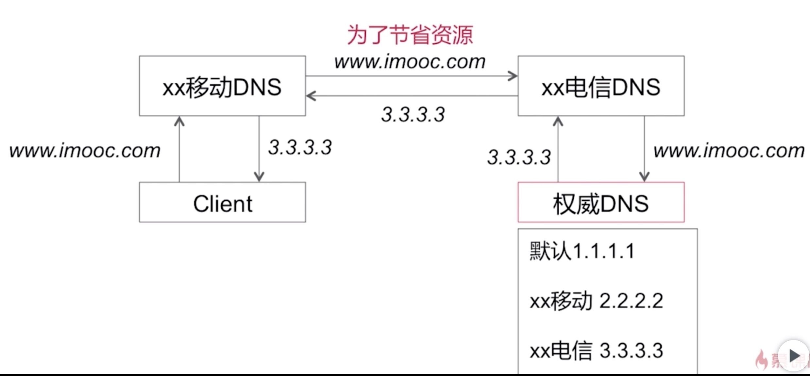
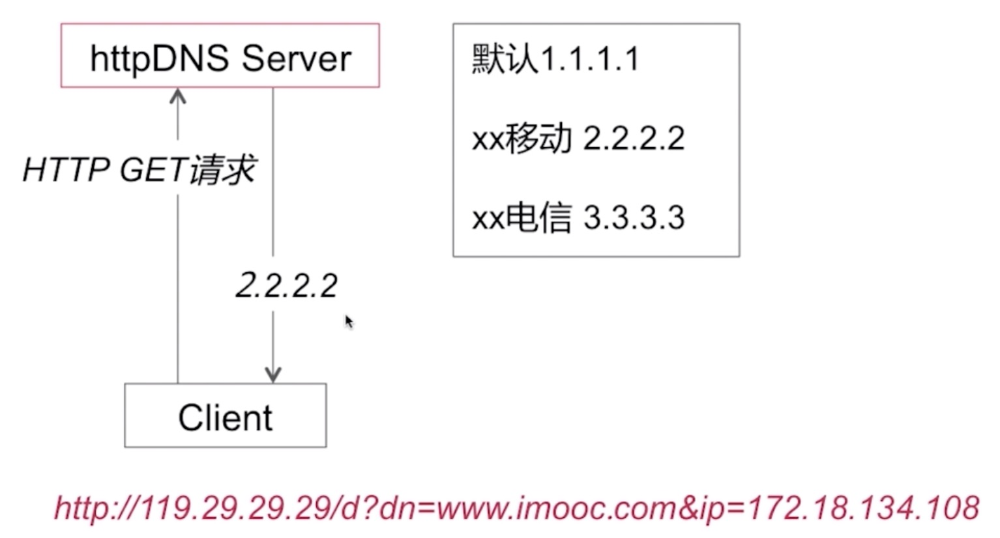

## DNS

### DNS解析

域名到IP地址的映射，DNS解析请求采用UDP数据报，且明文

由DNS服务器解析出IP地址，然后拿IP地址去请求服务器获取数据

### DNS解析查询的方式

##### 1.递归查询

”我去给你问一下“

##### 2.迭代查询

”我告诉你谁可能知道“

### DNS解析存在哪些常见的问题

##### 1.DNS劫持问题

DNS解析过程是用UDP数据包，并且是明文传输。因为是明文传输，所以就有可能被窃听

面试题：DNS劫持与HTTP的关系是怎样的？

    没关系

    * DNS解析是发生在HTTP建立连接之前
    * DNS解析请求使用UDP数据报，端口号53

##### 2.DNS的解析转发问题

移动的DNS服务器为了节省资源，把DNS转发给电信的DNS服务器去解析，然后造成了跨网访问，会造成请求缓慢

### 如何解决DNS劫持

##### 1.httpDNS

使用DNS协议向DNS服务器的53端口进行请求

使用HTTP协议向DNS服务器的80端口进行情趣

##### 2.长连接

