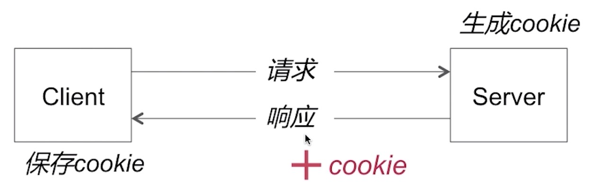
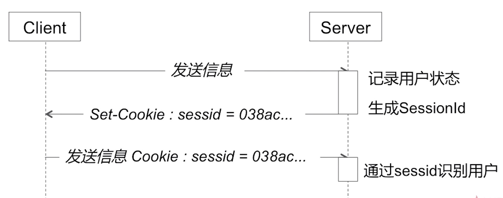

## Session/Cookie

HTTP协议无状态的补偿

### Cookie

Cookie主要用来记录用户状态，区分用户；`状态保存的在客户端`

客户端发送的cookie在http请求报文的Cookie首部字段中
服务器端设置http响应报文的Set-Cookie首部字段

怎样修改Cookie
* 新Cookie覆盖旧Cookie
* 覆盖规则：name、path、domain等需要与原Cookie一致

怎样删除一个Cookie
* 新Cookie覆盖旧Cookie
* 覆盖规则：name、path、domain等需要与原Cookie一致
* 设置Cookie的expires=过去的一个时间点，或者maxAge=0

怎样保证Cookie的安全？
* 对Cookie进行加密处理
* 只在https上携带Cookie
* 设置Cookie为httpOnly,防止跨站脚本攻击

### Session

Session也是用来记录用户状态，区分用户的；`状态保存的在服务器端`

### Session和Cookie的关系是怎样的？

* Session需要依赖于Cookie机制

