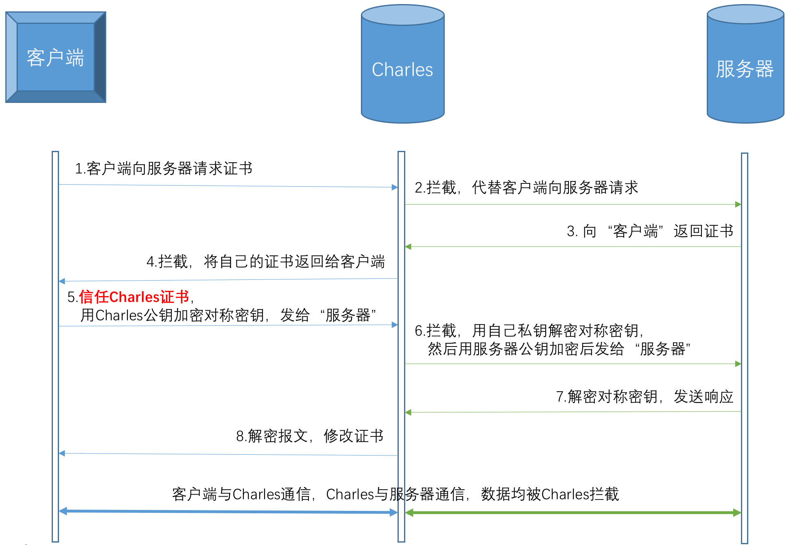

## Charles抓取HTTPS原理

Charles作为一个“**中间人代理**”，当客户端和服务器通信时，Charles接收服务器的证书，然后动态生成一张证书发送给客户端，也就是说Charles作为中间代理在客户端和服务器之间通信，所以通信的数据可以被Charles拦截并解密。由于Charles更改了证书，客户端校验不通过会给出安全警告，必须安装Charles的证书后才能进行正常访问。

1. 客户端向服务器发起HTTPS请求
2. Charles拦截客户端的请求，伪装成客户端向服务器进行请求
3. 服务器向“客户端”（实际上是Charles）返回服务器的CA证书
4. Charles拦截服务器的响应，获取服务器证书公钥，然后自己制作一张证书，将服务器证书替换后发送给客户端。**（这一步，Charles拿到了服务器证书的公钥）**
5. 客户端接收到“服务器”（实际上是Charles）的证书后，生成一个对称密钥，用Charles的公钥加密，发送给“服务器”（Charles）
6. Charles拦截客户端的响应，用自己的私钥解密对称密钥，然后用服务器证书公钥加密，发送给服务器。**（这一步，Charles拿到了对称密钥）**
7. 服务器用自己的私钥解密对称密钥，向“客户端”（Charles）发送响应
8. Charles拦截服务器的响应，替换成自己的证书后发送给客户端
9. 至此，连接建立，Charles拿到了 服务器证书的公钥 和 客户端与服务器协商的对称密钥，之后就可以解密或者修改加密的报文了。

HTTPS抓包的原理还是挺简单的，简单来说，就是Charles作为“**中间人代理**”，拿到了 **服务器证书公钥** 和 **HTTPS连接的对称密钥**，前提是客户端选择信任并安装Charles的CA证书，否则客户端就会“报警”并中止连接。这样看来，HTTPS还是很安全的。
